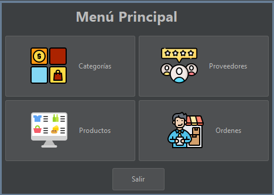

# Laboratorio de Conexión a Bases de datos (Java - SQL SERVER)

## Objetivo

Para efectos de este laboratorio el o la estudiante aprenderá el proceso de conexión de una aplicación de escritorio creada en **JAVA** y conectada con **SQL Server**, utilizando el *JDBC* correspondiente.

## Requisitos:

1. [JAVA JDK 11 o Superior](https://www.oracle.com/java/technologies/javase/jdk17-archive-downloads.html) - [Guía instalación](https://seth09work.notion.site/Instalaci-n-del-JDK-de-JAVA-eae5ce9e6e8b459284099ce17b494799?pvs=4)
2. [NetBeans en su versión 17 o superior](https://netbeans.apache.org/) - [Guía instalación](https://seth09work.notion.site/Instalaci-n-de-Netbeans-IDE-JAVA-5ff0d7538f4246cf94d02c2cafeceaf2?pvs=4)
3. [SQL Server Express 2019 o superior.](https://www.microsoft.com/es-es/sql-server/sql-server-downloads) 
4. [SQL Server Management Studio (SSMS) en su ultima versión](https://learn.microsoft.com/es-es/sql/ssms/download-sql-server-management-studio-ssms?view=sql-server-ver16) - [Guía Instalación de SQL SERVER 2019 & SSMS](https://seth09work.notion.site/Instalaci-n-del-JDK-de-JAVA-eae5ce9e6e8b459284099ce17b494799?pvs=4)
5. [JDBC de SQL SERVER para JAVA.](https://learn.microsoft.com/en-us/sql/connect/jdbc/microsoft-jdbc-driver-for-sql-server?view=sql-server-ver16)

## Que es JDBC

JDBC se deriva de la abreviatura de Java™ EE Database Connectivity, que se refiere a la conectividad de bases de datos en el contexto de desarrollo de Java EE. Es una tecnología ampliamente reconocida en el ámbito de Java EE y se utiliza comúnmente para facilitar la interacción con bases de datos. JDBC opera como una interfaz de programación a nivel de llamadas, lo que implica que las consultas SQL se transmiten como secuencias a esta interfaz. Luego, la interfaz se encarga de ejecutar estas consultas en sistemas de gestión de bases de datos relacionales (RDBMS). Un aspecto destacable es que las secuencias que contienen estas consultas pueden ser modificadas durante la ejecución, lo que confiere a JDBC un carácter dinámico.

### Pasos para crear un Conexión en JAVA a través de JDBC

1. Cargar el **DRIVER** de JAVA para la Motor de base de datos a utilizar.
2. Establecer la conexión con la base de datos.
3. Crear las sentencias a ejecutar.
4. Ejecutar las sentencias.
5. Trabajar con los resultados obtenidos de la ejecución de sentencias (Cuando se requiere).
6. Cerrar los objetos de la conexión utilizados.

### Driver JDBC para SQL SERVER

* Se encuentra en el paquete ***com.microsoft.sqlserver.jdbc***
* Se utiliza la clase ***SQLServerDriver***

*Nota: Esto puede variar dependiendo de driver a utilizar y del motor de la base de datos.*

## Configuración de SQL SERVER

Antes de iniciar con el proyecto se deberá de configurar el motor de bases de datos para que acepte las conexión atreves del protocolo TCP/IP para ello se deberá realizar lo siguiente:

### Configuración del puerto TCP/IP

Primero se debe ejecutar la aplicación **SQL Server 2022 Configuration Manager** para habilitar el puerto TCP/IP

En la ventana que se despliega se deberá seleccionar la opción **SQL Server Network Configuration** → **Protocols for SQLEXPRESS** (Esta ultima depende la versión de SQL SERVER), luego se deberá dar clic en la opción **TCP/IP**:


En la ventana que se despliega se deberá configurar en la pestaña **Protocol** la opción de **Enabled en Yes** a como se muestra en la imagen: 


luego en la pestaña de **IP Addresses** se deberá de configurar la opción de **IPALL** colocando el **TCP Dynamic Ports** en **1433** a como se muestra en la imagen:


Luego se deberá dar clic en el botón **Aplicar** y para que los cambios surtan efecto se deberá reiniciar el motor de bases de datos, a ello se debe dar clic en **SQL Server Services** luego clic derecho en **SQL Server (SQLEXPRESS)** y clic en **Restart**.


## Pasos para realizar la conexión de JAVA - NetBeans con SQLSERVER

### 1. Base de datos (SQL SERVER)

#### 1. Crear usuario en SQL SERVER.

Para este paso se deberá tener encuenta que en la [Guía de Instalación de SQL SERVER 2019 & SSMS](https://seth09work.notion.site/Instalaci-n-del-JDK-de-JAVA-eae5ce9e6e8b459284099ce17b494799?pvs=4), se habilita la autenticación para usuario SQL SERVER, por lo que se da por entendido que ya se encuentra activado, por lo que se procede a crear el usuario:

1. Se debera dar clic en la carpeta **Security**, luego clic derecho en **Logins** y luego en **New Login**


2. En la ventana que se despliega, se deberá configurar el usuario según lo que se muestra en la siguientes imágenes: 

*General*

*Server Roles*


#### 2. Crear la base de datos en SQL Server (SSMS)

Para efectos de este laboratorio de se creara una pequeña base de datos para el control de inventario de una pequeña empresa, esta solo abarcara el CRUD (Created-Read-Update-Delete) para productos, categorías, proveedores y ordenes de compra, se adjunto del diagrama relacional:


se adjunta el script de la base de datos

```SQL
--Crear la base de datos
CREATE DATABASE dbControlInventario;
GO

USE dbControlInventario;
GO

--Tabla de control de Categorias
CREATE TABLE tblCategoria(
	idCategoria INT PRIMARY KEY IDENTITY,
	nombre VARCHAR(60) NOT NULL
);
GO

--Tabla de control de Proveedores
CREATE TABLE tblProveedor(
	idProveedor INT PRIMARY KEY IDENTITY,
	nombre VARCHAR(150) NOT NULL,
	direccion VARCHAR(300) NULL,
	telefono VARCHAR(15) NOT NULL
);
GO

--Tabla de control de Productos
CREATE TABLE tblProducto(
	idProducto INT PRIMARY KEY IDENTITY,
	nombre VARCHAR(40) NOT NULL,
	precio MONEY DEFAULT 0,
	stock INT,
	imagen VARBINARY(MAX),
	idCategoria INT FOREIGN KEY REFERENCES tblCategoria(idCategoria),
	idProveedor INT FOREIGN KEY REFERENCES tblProveedor(idProveedor)
);
GO

--Tabla de control de las ordenes de compra
CREATE TABLE tblCompra(
	idCompra INT PRIMARY KEY IDENTITY,
	fecha DATE,
	cantidad INT,
	idProducto INT FOREIGN KEY REFERENCES tblProducto(idProducto),
	idProveedor INT FOREIGN KEY REFERENCES tblProveedor(idProveedor)
);
GO

-- Procedimientos almacenados

--Procedimientos para la tabla de productos
--Procedimiento para agregar un producto
CREATE or ALTER PROCEDURE sp_AgregarProducto
@nombreProducto VARCHAR(40),
@precio MONEY,
@cantidad INT,
@imagen VARBINARY(MAX),
@idCategoria INT,
@idProveedor INT
AS
BEGIN
	
	INSERT INTO tblProducto (nombre,precio,stock,imagen,idCategoria,idProveedor) 
		VALUES (@nombreProducto,@precio,@cantidad,@imagen,@idCategoria,@idProveedor)

END
GO

--Procedimiento para modificar un producto
CREATE PROCEDURE sp_ActualizarProducto
@idProducto INT,
@nombreProducto VARCHAR(40),
@precio MONEY,
@cantidad INT,
@imagen VARBINARY(MAX),
@idCategoria INT,
@idProveedor INT
AS
BEGIN
	
	UPDATE tblProducto SET nombre = @nombreProducto, precio = @precio,
		stock = @cantidad, imagen= @imagen, idCategoria = @idCategoria, idProveedor= @idProveedor 
		WHERE idProducto = @idProducto	

END
GO

-- Procedimiento para eliminar un producto
CREATE PROCEDURE sp_EliminarProducto
@idProducto INT
AS
BEGIN
	DELETE FROM tblProducto WHERE idProducto = @idProducto	
END
GO

-- Procedimiento  Consultar Producto con filtros
CREATE or ALTER PROCEDURE sp_ConsultarProducto
@idProveedor INT = NULL,
@idCategoria INT = NULL,
@nombre VARCHAR(40) = NULL
AS 
BEGIN
	
	SELECT prod.idProducto, prod.nombre [producto], prod.precio, prod.stock, prod.imagen, prod.idCategoria, cat.nombre [categoria], prod.idproveedor, prov.nombre [proveedor]
	FROM tblProducto prod 
	INNER JOIN tblCategoria cat ON prod.idCategoria = cat.idCategoria 
	INNER JOIN tblProveedor prov ON prov.idProveedor = prod.idProveedor  
	WHERE 
		(prod.idProveedor = @idProveedor OR @idProveedor IS NULL) AND 
		(prod.idCategoria = @idCategoria OR @idCategoria IS NULL) AND 
		(prod.nombre LIKE '%'+@nombre+'%'OR @nombre IS NULL);
END;
GO

--Procedimientos Almacenados de la tabla de Categorías
--Procedimiento para agregar una categoría
CREATE OR ALTER PROCEDURE spCrearCategoria
    @nombre VARCHAR(60)
AS
BEGIN
    INSERT INTO tblCategoria (nombre)
    VALUES (@nombre);
END;
GO

--Procedimiento para modificar un categoría
CREATE or ALTER PROCEDURE spActualizarCategoria
    @idCategoria INT,
    @nuevoNombre VARCHAR(60)
AS
BEGIN
    UPDATE tblCategoria
    SET nombre = @nuevoNombre
    WHERE idCategoria = @idCategoria;
END;
GO

--Procedimiento para eliminar una categoría 
CREATE PROCEDURE spEliminarCategoria
    @idCategoria INT
AS
BEGIN
    DELETE FROM tblCategoria
    WHERE idCategoria = @idCategoria;
END;
GO

--Procedimiento para consultar las categorias
CREATE PROCEDURE spObtenerCategorias
@nombre VARCHAR(60) = NULL
AS
BEGIN
    SELECT * FROM tblCategoria WHERE (nombre LIKE '%' +@nombre+ '%' OR @nombre IS NULL);
END;
GO

--Procedimientos Almacenados de la tabla de Proveedores
--Procedimiento para agregar una Proveedores
CREATE or ALTER PROCEDURE spCrearProveedor
    @nombre VARCHAR(150),
    @direccion VARCHAR(300),
    @telefono VARCHAR(15)
AS
BEGIN
    INSERT INTO tblProveedor (nombre, direccion, telefono)
    VALUES (@nombre, @direccion, @telefono);
END;
GO

--Procedimiento para modificar un proveedor
CREATE or ALTER PROCEDURE spActualizarProveedor
    @idProveedor INT,
    @nuevoNombre VARCHAR(150),
    @nuevaDireccion VARCHAR(300),
    @nuevoTelefono VARCHAR(15)
AS
BEGIN
    UPDATE tblProveedor
    SET nombre = @nuevoNombre,
        direccion = @nuevaDireccion,
        telefono = @nuevoTelefono
    WHERE idProveedor = @idProveedor;
END;
GO

--Procedimiento para eliminar un proveedor
CREATE OR ALTER PROCEDURE spEliminarProveedor
    @idProveedor INT
AS
BEGIN
    DELETE FROM tblProveedor
    WHERE idProveedor = @idProveedor;
END;
GO

--Procedimiento para consultar proveedores
CREATE PROCEDURE spObtenerProveedores
@nombre VARCHAR(150) = NUll
AS
BEGIN
    SELECT * FROM tblProveedor WHERE (nombre LIKE '%' +@nombre+ '%' OR @nombre IS NULL);
END;
GO

```
### 2. Crear el proyecto Java en Netbeans.

Primero se deberá crear el proyecto utilizando el IDE de NetBeans, en este caso el tipo de proyecto sera **Java Application** que se encuentra en la categoría de **Java with Ant**


Luego se deberá definir elementos como el nombre del proyecto y la ruta donde se almacenara, en este caso solo se modificara el nombre del proyecto por "ControlInventarioSQL"


#### Agregar librería de JDBC al proyecto

Para agregar la librería de JDBC al proyecto, previamente se debió descargar de los enlaces colocados en el aparatado de *Requerimientos* y luego se deberá dar clic derecho sobre la carpeta **Libraries** y luego clic en **Add JAR/Folder** a como se muestra en la imagen:


En la ventana que se despliega se deberá de localizar el  JDBC. ***Se recomienda la creación de un paquete dentro del proyecto en el cual se almaceno dicho archivo, por ejemplo: en el paquete con nombre libs***


Con estos pasos se deberá haber agregado la librería del JDBC al proyecto:


#### Crear la clase de conexión en el proyecto
Para ello se deberá crear un nuevo paquete con el nombre de **conexionDB** y dentro de este paquete se deberá agregar una clase con el nombre **conexionSQLServer** a como se muestran en las siguientes imágenes:


En la ventana se se despliega se deberá colocar el nombre antes mencionado:


Ahora se deberá crear la clase con el nombre **conexionSQLServer** a como se muestra en las imágenes:


Antes de iniciar debemos importar la librería **java.sql**
```java
import java.sql.*;
```
En la clase creada anteriormente se deberá crear el código necesario para realizar la conexión, en este caso se plantea separarlo en una clase para su reutilización, para ellos se iniciara definiendo unas constantes para la clase conexión:

*Nota:* Los valores del **JDBC_DRIVER, JDBC_DB, JDBC_USER, JDBC_PASS**: debe ser cambiados de acuerdo a las necesidades

``` java
    //String que especifica el driver de conexión
    private static String JDBC_DRIVER = "com.microsoft.sqlserver.jdbc.SQLServerDriver";
    //String que especifica el nombre de la base de datos a la que se realizara la conexión
    private static String JDBC_DB = "dbNotasAcademicas";
    //String que especifica el nombre de usuario con el que se conectara a la BD
    private static String JDBC_USER = "sa";
    //String que especifica la contraseña del usuario con el que se conectara a la BD
    private static String JDBC_PASS = "1234";
    //Variable que almancena el driver creado.
    private static Driver driver = null;
    //String que especifica la ruta de conexión a la base de datos 
    private static String JDBC_URL = "jdbc:sqlserver://localhost:1433;databaseName="+JDBC_DB+";encrypt=false";

```
En este punto se deberá crear el método para retornar la conexión creada, utilizando el siguiente código:

``` java
public static synchronized Connection getConnection() throws SQLException {

        if (driver == null) {
            try {
                
                //Se Carga el driver JDBC
                Class jdbcDriverClass = Class.forName(JDBC_DRIVER);

                //Utiliza para crear una instancia de la clase del controlador JDBC cargada previamente
                driver = (Driver) jdbcDriverClass.getDeclaredConstructor().newInstance();
               
                //Se utiliza para registrar el controlador JDBC que has creado previamente con la instancia
                DriverManager.registerDriver(driver);

            } catch (Exception ex) {
                System.out.println("Fallo al cargar el driver");
                ex.printStackTrace();
            }
        }
        //Establecer una conexión a la base de datos utilizando los detalles de conexión proporcionados
        return DriverManager.getConnection(JDBC_URL, JDBC_USER, JDBC_PASS);
    }
        
```

Por ultimo en esta clase se deberá crear los métodos para el cierre tanto de la conexión,los ResultSet asi como de los PreparedStatement (*es una interfaz en Java que se utiliza para ejecutar consultas SQL parametrizadas en bases de datos a través de JDBC (Java Database Connectivity)*), de la siguiente manera:

``` java
  //cierra los ResultSet abiertos.
  public static void close(ResultSet rs) {
        try {
            if (rs != null) {
                rs.close();
            }
        } catch (SQLException ex) {
            ex.printStackTrace();
        }
    }

  //Cierra los PreparedStatement abiertos, si lo están
  public static void close(PreparedStatement stmt) {
        try {
            if (stmt != null) {
                stmt.close();
            }
        } catch (SQLException ex) {
            ex.printStackTrace();
        }
    }

    //Cierra la conexión abierta, si lo están
    public static void close(Connection conn) {
        try {
            if (conn != null) {
                conn.close();
            }
        } catch (SQLException ex) {
            ex.printStackTrace();
        }
    }
	
	public static void close(CallableStatement cstmt) {
        try {
            if (cstmt != null) {
                cstmt.close();
            }
        } catch (SQLException ex) {
            ex.printStackTrace();
        }
```
**La clase completa quedara de la siguiente manera:**
```java

package ConexionBD;

/**
 * @author Seth
 */
import java.sql.*;

public class conexionSQLServer {

    //String que especifica el driver de conexión
    private static String JDBC_DRIVER = "com.microsoft.sqlserver.jdbc.SQLServerDriver";
    //String que especifica el nombre de la base de datos a la que se realizara la conexión
    private static String JDBC_DB = "dbNotasAcademicas";
    //String que especifica el nombre de usuario con el que se conectara a la BD
    private static String JDBC_USER = "sa";
    //String que especifica la contraseña del usuario con el que se conectara a la BD
    private static String JDBC_PASS = "1234";
    //Variable que almancena el driver creado.
    private static Driver driver = null;
    //String que especifica la ruta de conexión a la base de datos 
    private static String JDBC_URL = "jdbc:sqlserver://localhost:1433;databaseName=" + JDBC_DB + ";encrypt=false";

    public static synchronized Connection getConnection() throws SQLException {

        if (driver == null) {
            try {

                //Se Carga el driver JDBC
                Class jdbcDriverClass = Class.forName(JDBC_DRIVER);

                //Utiliza para crear una instancia de la clase del controlador JDBC cargada previamente
                driver = (Driver) jdbcDriverClass.getDeclaredConstructor().newInstance();

                //Se utiliza para registrar el controlador JDBC que has creado previamente con la instancia
                DriverManager.registerDriver(driver);

            } catch (Exception ex) {
                System.out.println("Fallo al cargar el driver");
                ex.printStackTrace();
            }
        }
        //Establecer una conexión a la base de datos utilizando los detalles de conexión proporcionados
        return DriverManager.getConnection(JDBC_URL, JDBC_USER, JDBC_PASS);
    }

    //cierra los ResultSet abiertos.
    public static void close(ResultSet rs) {
        try {
            if (rs != null) {
                rs.close();
            }
        } catch (SQLException ex) {
            ex.printStackTrace();
        }
    }

    //Cierra los PreparedStatement abiertos, si lo están
    public static void close(PreparedStatement stmt) {
        try {
            if (stmt != null) {
                stmt.close();
            }
        } catch (SQLException ex) {
            ex.printStackTrace();
        }
    }

    //Cierra la conexión abierta, si lo están
    public static void close(Connection conn) {
        try {
            if (conn != null) {
                conn.close();
            }
        } catch (SQLException ex) {
            ex.printStackTrace();
        }
    }

	public static void close(CallableStatement cstmt) {
        try {
            if (cstmt != null) {
                cstmt.close();
            }
        } catch (SQLException ex) {
            ex.printStackTrace();
        }

}

```
#### Creación de Interfaz Gráfica de Usuario (GUI)
En cuanto a la interfaz gráfica de Usuario no se detallara a profundidad la creación de la misma solo se mostrar la pantallas creadas para cada uno de los casos:

##### Formulario de Categorías

Se deberá crear un JFrame con el nombre de **frmControlCategoria** el el cual se deberá crear la interfaz similar a la que se muestra en la imagen:


**Desglose de controles utilizados:**
<table>
 <thead>
    <tr> 
        <th>Control </th>
        <th>Propiedad </th>
        <th>Valor</th>
    </tr>
  </thead>
  <tbody>
  <tr>
  <td>JFrame</td>
    <td>defaultCloseOperation</td>
    <td>EXIT_ON_CLOSE</td>
  </tr>
  <tr>
    <td>jLabel</td>
    <td>text</td>
    <td>Control de Categoria</td>
  </tr>
  <tr>
    <td>JPanel</td>
    <td>border → titled border → title</td>
    <td>Datos de la Categoría</td>
  </tr>
  <tr>
    <td>JPanel</td>
    <td>border → titled border → title</td>
    <td>Lista de Categorías</td>
  </tr>
  <tr>
    <td>JLabel</td>
    <td>text</td>
    <td>Nombre de la categoría</td>
  </tr>
  <tr>
    <td rowspan=2>Text Field</td>
    <td>text</td>
    <td>"  " 👉🏻 Vació</td>
  </tr>
  <tr>
    <td>Variable Name</td>
    <td>txtNombreCat</td>
  </tr>

  <tr>
    <td rowspan=3>Button</td>
    <td>text</td>
    <td>Guardar</td>
  </tr>
  <tr>
    <td>Variable Name</td>
    <td>btnGuardar</td>
  </tr>
    <tr>
    <td>Icon</td>
    <td>Buscar el icono en el paquete de recurso</td>
  </tr>

 <tr>
    <td rowspan=3>Button</td>
    <td>text</td>
    <td>Eliminar</td>
  </tr>
  <tr>
    <td>Variable Name</td>
    <td>btnEliminar</td>
  </tr>
    <tr>
    <td>Icon</td>
    <td>Buscar el icono en el paquete de recurso</td>
  </tr>

 <tr>
    <td rowspan=3>Button</td>
    <td>text</td>
    <td>Limpiar</td>
  </tr>
  <tr>
    <td>Variable Name</td>
    <td>btnLimpiar</td>
  </tr>
    <tr>
    <td>Icon</td>
    <td>Buscar el icono en el paquete de recurso</td>
  </tr>
   <tr>
    <td>JLabel</td>
    <td>text</td>
    <td>Buscar:</td>
  </tr>
  <tr>
    <td rowspan=2>Text Field</td>
    <td>text</td>
    <td>"  " 👉🏻 Vació</td>
  </tr>
  <tr>
    <td>Variable Name</td>
    <td>txtBuscarCat</td>
  </tr>
  </tbody>

  <tr>
    <td>Table</td>
    <td>Variable Name</td>
    <td>tblListaCategorias</td>
  </tr>
</table>


***Nota:*** Se le debe de quitar el método *main* a los deferentes formulario, ya que solo deberá de existir un punto de arranque en la aplicación y este se encuentra en la clase base *ControlInventarioSQL*

##### Formulario de Proveedores

Se deberá crear un JFrame con el nombre de **frmControlProveedor** el el cual se deberá crear la interfaz similar a la que se muestra en la imagen:


**Desglose de controles utilizados:**
<table>
 <thead>
    <tr> 
        <th>Control </th>
        <th>Propiedad </th>
        <th>Valor</th>
    </tr>
  </thead>
  <tbody>
    <td>JFrame</td>
    <td>defaultCloseOperation</td>
    <td>EXIT_ON_CLOSE</td>
  </tr>
  <tr>
    <td>jLabel</td>
    <td>text</td>
    <td>Control de Proveedores</td>
  </tr>
  <tr>
    <td>JPanel</td>
    <td>border → titled border → title</td>
    <td>Datos del Proveedor</td>
  </tr>
  <tr>
    <td>JPanel</td>
    <td>border → titled border → title</td>
    <td>Lista de Proveedores</td>
  </tr>
  <tr>
    <td>JLabel</td>
    <td>text</td>
    <td>Nombre Proveedor</td>
  </tr>

  <tr>
    <td rowspan=2>Text Field</td>
    <td>text</td>
    <td>"  " 👉🏻 Vació</td>
  </tr>
  <tr>
    <td>Variable Name</td>
    <td>txtNombreProv</td>
  </tr>

  <tr>
    <td>JLabel</td>
    <td>text</td>
    <td>Teléfono</td>
  </tr>
  <tr>
    <td rowspan=2>Text Field</td>
    <td>text</td>
    <td>"  " 👉🏻 Vació</td>
  </tr>
  <tr>
    <td>Variable Name</td>
    <td>txtTelefonoProv</td>
  </tr>

  <tr>
    <td>JLabel</td>
    <td>text</td>
    <td>Dirección</td>
  </tr>
    <tr>
    <td rowspan=2>Text Field</td>
    <td>text</td>
    <td>"  " 👉🏻 Vació</td>
  </tr>
  <tr>
    <td>Variable Name</td>
    <td>txtDireccionProv</td>
  </tr>
  <tr>
    <td rowspan=3>Button</td>
    <td>text</td>
    <td>Guardar</td>
  </tr>
  <tr>
    <td>Variable Name</td>
    <td>btnGuardarProv</td>
  </tr>
    <tr>
    <td>Icon</td>
    <td>Buscar el icono en el paquete de recurso</td>
  </tr>

 <tr>
    <td rowspan=3>Button</td>
    <td>text</td>
    <td>Eliminar</td>
  </tr>
  <tr>
    <td>Variable Name</td>
    <td>btnEliminarProv</td>
  </tr>
    <tr>
    <td>Icon</td>
    <td>Buscar el icono en el paquete de recurso</td>
  </tr>

 <tr>
    <td rowspan=3>Button</td>
    <td>text</td>
    <td>Limpiar</td>
  </tr>
  <tr>
    <td>Variable Name</td>
    <td>btnLimpiarProv</td>
  </tr>
    <tr>
    <td>Icon</td>
    <td>Buscar el icono en el paquete de recurso</td>
  </tr>
   <tr>
    <td>JLabel</td>
    <td>text</td>
    <td>Filtro:</td>
  </tr>
  <tr>
    <td rowspan=2>Text Field</td>
    <td>text</td>
    <td>"  " 👉🏻 Vació</td>
  </tr>
  <tr>
    <td>Variable Name</td>
    <td>txtBuscarProv</td>
  </tr>
  </tbody>

  <tr>
    <td>Table</td>
    <td>Variable Name</td>
    <td>tblListaProveedores</td>
  </tr>
</table>

##### Formulario de Productos

Se deberá crear un JFrame con el nombre de **frmProducto** el el cual se deberá crear la interfaz similar a la que se muestra en la imagen:


**Desglose de controles utilizados:**

<table>
 <thead>
    <tr> 
        <th>Control </th>
        <th>Propiedad </th>
        <th>Valor</th>
    </tr>
  </thead>
  <tbody>
    <td>JFrame</td>
    <td>defaultCloseOperation</td>
    <td>EXIT_ON_CLOSE</td>
  </tr>
  <tr>
    <td>jLabel</td>
    <td>text</td>
    <td>Control de Productos</td>
  </tr>
  <tr>
    <td>JPanel</td>
    <td>border → titled border → title</td>
    <td>Datos del Producto</td>
  </tr>
  <tr>
    <td>JPanel</td>
    <td>border → titled border → title</td>
    <td>Lista de Productos</td>
  </tr>
  <tr>
    <td>JLabel</td>
    <td>text</td>
    <td>Nombre Producto:</td>
  </tr>

  <tr>
    <td rowspan=2>Text Field</td>
    <td>text</td>
    <td>"  " 👉🏻 Vació</td>
  </tr>
  <tr>
    <td>Variable Name</td>
    <td>txtNombreProd</td>
  </tr>

  <tr>
    <td>JLabel</td>
    <td>text</td>
    <td>Precio</td>
  </tr>
  <tr>
    <td rowspan=2>Text Field</td>
    <td>text</td>
    <td>"  " 👉🏻 Vació</td>
  </tr>
  <tr>
    <td>Variable Name</td>
    <td>txtPrecioProd</td>
  </tr>

  <tr>
    <td>JLabel</td>
    <td>text</td>
    <td>Cantidad</td>
  </tr>
    <tr>
    <td>JSpinner</td>
    <td>Variable Name</td>
    <td>spnCantidadProd</td>
  </tr>

  <tr>
    <td>JLabel</td>
    <td>text</td>
    <td>Proveedor</td>
  </tr>

  <tr>
    <td>JComboBox</td>
    <td>Variable Name</td>
    <td>cmbProveedor</td>
  </tr>

  <tr>
    <td>JLabel</td>
    <td>text</td>
    <td>Categoría</td>
  </tr>

  <tr>
    <td >JComboBox</td>
    <td>Variable Name</td>
    <td>cmbCategoria</td>
  </tr>
 
  <tr>
    <td rowspan=3>Button</td>
    <td>text</td>
    <td>Buscar</td>
  </tr>
  <tr>
    <td>Variable Name</td>
    <td>btnBuscarImage</td>
  </tr>
    <tr>
    <td>Icon</td>
    <td>Buscar el icono en el paquete de recurso</td>
  </tr>

  <tr>
    <td rowspan=2>JLabel</td>
    <td>text</td>
    <td>" " 👉🏻 Vació</td>
  </tr>
  <tr>
    <td>Icon</td>
    <td>Buscar el icono en el paquete de recurso</td>
  </tr>

  <tr>
    <td rowspan=3>Button</td>
    <td>text</td>
    <td>Guardar</td>
  </tr>
  <tr>
    <td>Variable Name</td>
    <td>btnGuardarProd</td>
  </tr>
    <tr>
    <td>Icon</td>
    <td>Buscar el icono en el paquete de recurso</td>
  </tr>

 <tr>
    <td rowspan=3>Button</td>
    <td>text</td>
    <td>Eliminar</td>
  </tr>
  <tr>
    <td>Variable Name</td>
    <td>btnEliminarProd</td>
  </tr>
    <tr>
    <td>Icon</td>
    <td>Buscar el icono en el paquete de recurso</td>
  </tr>

 <tr>
    <td rowspan=3>Button</td>
    <td>text</td>
    <td>Limpiar</td>
  </tr>
  <tr>
    <td>Variable Name</td>
    <td>btnLimpiarProd</td>
  </tr>
    <tr>
    <td>Icon</td>
    <td>Buscar el icono en el paquete de recurso</td>
  </tr>
   <tr>
    <td>JLabel</td>
    <td>text</td>
    <td>Filtro:</td>
  </tr>

  <tr>
    <td>JComboBox</td>
    <td>Variable Name</td>
    <td>cmbCategoriaFiltro</td>
  </tr>
 <tr>
    <td>JComboBox</td>
    <td>Variable Name</td>
    <td>cmbProveedorFiltro</td>
  </tr>
     <tr>
    <td>JLabel</td>
    <td>text</td>
    <td>Nombre Prod:</td>
  </tr>

  <tr>
    <td rowspan=2>Text Field</td>
    <td>text</td>
    <td>"  " 👉🏻 Vació</td>
  </tr>
  <tr>
    <td>Variable Name</td>
    <td>txtBuscarProv</td>
  </tr>
  </tbody>

  <tr>
    <td>Table</td>
    <td>Variable Name</td>
    <td>tblListaProductos</td>
  </tr>
</table>

##### Formulario de Menú General

Se deberá crear un JFrame con el nombre de **frmMenuGeneral** el el cual se deberá crear la interfaz similar a la que se muestra en la imagen:



En cuanto a los control para el menú principal queda a tu gusto a la creación de este, la imagen es solo de referencia. 

*Recuerda quitar el método main del JFrame.*

***La GUI de la orden de Compra se dejara a criterio del estudiante → Laboratorio evaluado.***


##### Vinculando la GUI 

##### Arranque de la aplicación.
En la clase principal "la que contiene el método **main**" en mi caso tiene el nombre de "ControlInventarioSQL" se deberá colocar el siguiente código dentro del método **main**:

Importar librerías:
```java
import com.formdev.flatlaf.FlatLightLaf;
import gui.frmMenuGeneral;
import javax.swing.UIManager;
```


```java
public class ControlInventarioSQL {

    /**
     * @param args the command line arguments
     */
    public static void main(String[] args) {
       
     try{
         //Se utiliza el UI Manager para cambiar el estilo gráfico de la ventanas (look and feel)
        UIManager.setLookAndFeel( new FlatLightLaf() );
      }catch(Exception ex){
           System.err.println( "Fallo al cargar el look and feel" );
      }
      
     //Se crea una instancia del menu general y se vuelve visible.
        frmMenuGeneral menu = new frmMenuGeneral();
        menu.setLocationRelativeTo(null);
        menu.setVisible(true);
        
        
    }
    
}


```

##### Menu Principal 

En el evento clic (actionPerformed) del botón de **categoría** deberemos crear el siguiente código:
```java

    private void btnCategoriasActionPerformed(java.awt.event.ActionEvent evt) {                                              
       frmCategoria cat = new frmCategoria();
       cat.setLocationRelativeTo(null);
       cat.setVisible(true);       
      
    }  
```
En el evento clic (actionPerformed) del botón de **proveedores** deberemos crear el siguiente código:
```java
    private void btnProveedoresActionPerformed(java.awt.event.ActionEvent evt) {                                               
       frmControlProveedor prov = new frmControlProveedor();
       prov.setLocationRelativeTo(null);
       prov.setVisible(true);   
    }   
```
En el evento clic (actionPerformed) del botón de **productos** deberemos crear el siguiente código:

```java
    private void btnProductosActionPerformed(java.awt.event.ActionEvent evt) {                                             
        frmProducto prod = new frmProducto();
        prod.setLocationRelativeTo(null);
        prod.setVisible(true);
    }   
```
En el evento clic (actionPerformed) del botón de **salir** deberemos crear el siguiente código:

```java
    private void btnSalirActionPerformed(java.awt.event.ActionEvent evt) {                                         
        System.exit(0);
    }
```

#### Modelo JDBC para el procesamiento de datos.

En este proyecto por su simpleza no se implementara a fondo el modelo en capas, por esta razón no se creara la capa de datos sino que de forma directa se interactuará con los datos de la base de datos.

Para ello se necesitara crear un nuevo paquete para almacenar las clases JDBC con el nombre **ModeloJDBC**.


##### CategoriaJDBC

En este punto se iniciara a crear la lógica para la interacción con la base de datos, comenzado por la tabla de categorías, por ellos vamos a crear una clase **CategoriaJDBC** dentro del paquete **ModeloJDBC**


