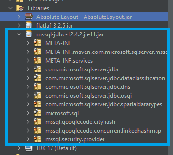
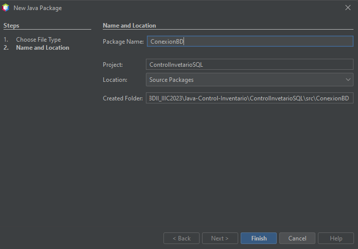
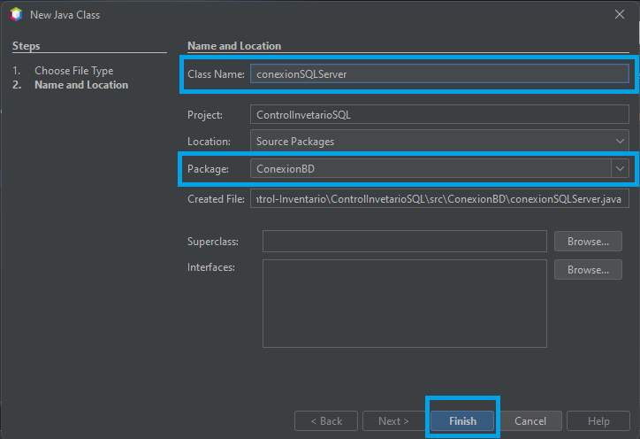

# Laboratorio de Conexión a Bases de datos (Java - SQL SERVER)

## Objetivo

Para efectos de este laboratorio el o la estudiante aprenderá el proceso de conexión de una aplicación de escritorio creada en **JAVA** y conectada con **SQL Server**, utilizando el *JDBC* correspondiente.

## Requisitos:

1. [JAVA JDK 11 o Superior](https://www.oracle.com/java/technologies/javase/jdk17-archive-downloads.html) - [Guía instalación](https://seth09work.notion.site/Instalaci-n-del-JDK-de-JAVA-eae5ce9e6e8b459284099ce17b494799?pvs=4)
2. [NetBeans en su versión 17 o superior](https://netbeans.apache.org/) - [Guía instalación](https://seth09work.notion.site/Instalaci-n-de-Netbeans-IDE-JAVA-5ff0d7538f4246cf94d02c2cafeceaf2?pvs=4)
3. [SQL Server Express 2019 o superior.](https://www.microsoft.com/es-es/sql-server/sql-server-downloads) 
4. [SQL Server Management Studio (SSMS) en su ultima versión](https://learn.microsoft.com/es-es/sql/ssms/download-sql-server-management-studio-ssms?view=sql-server-ver16) - [Guía Instalación de SQL SERVER 2019 & SSMS](https://seth09work.notion.site/Instalaci-n-y-configuraci-n-del-sistema-gestor-de-bases-de-datos-de-SQL-SERVER-9027a9827de34d9a82076f2caaa3f706?pvs=4)
5. [JDBC de SQL SERVER para JAVA.](https://learn.microsoft.com/en-us/sql/connect/jdbc/microsoft-jdbc-driver-for-sql-server?view=sql-server-ver16)

## Que es JDBC

JDBC se deriva de la abreviatura de Java™ EE Database Connectivity, que se refiere a la conectividad de bases de datos en el contexto de desarrollo de Java EE. Es una tecnología ampliamente reconocida en el ámbito de Java EE y se utiliza comúnmente para facilitar la interacción con bases de datos. JDBC opera como una interfaz de programación a nivel de llamadas, lo que implica que las consultas SQL se transmiten como secuencias a esta interfaz. Luego, la interfaz se encarga de ejecutar estas consultas en sistemas de gestión de bases de datos relacionales (RDBMS). Un aspecto destacable es que las secuencias que contienen estas consultas pueden ser modificadas durante la ejecución, lo que confiere a JDBC un carácter dinámico.

### Pasos para crear un Conexión en JAVA a través de JDBC

1. Cargar el **DRIVER** de JAVA para la Motor de base de datos a utilizar.
2. Establecer la conexión con la base de datos.
3. Crear las sentencias a ejecutar.
4. Ejecutar las sentencias.
5. Trabajar con los resultados obtenidos de la ejecución de sentencias (Cuando se requiere).
6. Cerrar los objetos de la conexión utilizados.

### Driver JDBC para SQL SERVER

* Se encuentra en el paquete ***com.microsoft.sqlserver.jdbc***
* Se utiliza la clase ***SQLServerDriver***

*Nota: Esto puede variar dependiendo de driver a utilizar y del motor de la base de datos.*

## Configuración de SQL SERVER

Antes de iniciar con el proyecto se deberá de configurar el motor de bases de datos para que acepte las conexión atreves del protocolo TCP/IP para ello se deberá realizar lo siguiente:

### Configuración del puerto TCP/IP

Primero se debe ejecutar la aplicación **SQL Server 2022 Configuration Manager** para habilitar el puerto TCP/IP

En la ventana que se despliega se deberá seleccionar la opción **SQL Server Network Configuration** → **Protocols for SQLEXPRESS** (Esta ultima depende la versión de SQL SERVER), luego se deberá dar clic en la opción **TCP/IP**:


En la ventana que se despliega se deberá configurar en la pestaña **Protocol** la opción de **Enabled en Yes** a como se muestra en la imagen: 


luego en la pestaña de **IP Addresses** se deberá de configurar la opción de **IPALL** colocando el **TCP Dynamic Ports** en **1433** a como se muestra en la imagen:


Luego se deberá dar clic en el botón **Aplicar** y para que los cambios surtan efecto se deberá reiniciar el motor de bases de datos, a ello se debe dar clic en **SQL Server Services** luego clic derecho en **SQL Server (SQLEXPRESS)** y clic en **Restart**.


## Pasos para realizar la conexión de JAVA - NetBeans con SQLSERVER

### 1. Base de datos (SQL SERVER)

#### 1. Crear usuario en SQL SERVER.

Para este paso se deberá tener en cuenta que en la [Guía de Instalación de SQL SERVER 2019 & SSMS](https://seth09work.notion.site/Instalaci-n-y-configuraci-n-del-sistema-gestor-de-bases-de-datos-de-SQL-SERVER-9027a9827de34d9a82076f2caaa3f706?pvs=4), se habilita la autenticación para usuario SQL SERVER, por lo que se da por entendido que ya se encuentra activado, por lo que se procede a crear el usuario:

1. Se deberá dar clic en la carpeta **Security**, luego clic derecho en **Logins** y luego en **New Login**


2. En la ventana que se despliega, se deberá configurar el usuario según lo que se muestra en la siguientes imágenes: 

*General*

*Server Roles*


#### 2. Crear la base de datos en SQL Server (SSMS)

Para efectos de este laboratorio de se creara una pequeña base de datos para el control de inventario de una pequeña empresa, esta solo abarcara el CRUD (Created-Read-Update-Delete) para productos, categorías, proveedores y ordenes de compra, se adjunto del diagrama relacional:


se adjunta el script de la base de datos

```SQL
--Crear la base de datos
CREATE DATABASE dbControlInventario;
GO

USE dbControlInventario;
GO

--Tabla de control de Categorías
CREATE TABLE tblCategoria(
	idCategoria INT PRIMARY KEY IDENTITY,
	nombre VARCHAR(60) NOT NULL
);
GO

--Tabla de control de Proveedores
CREATE TABLE tblProveedor(
	idProveedor INT PRIMARY KEY IDENTITY,
	nombre VARCHAR(150) NOT NULL,
	direccion VARCHAR(300) NULL,
	telefono VARCHAR(15) NOT NULL
);
GO

--Tabla de control de Productos
CREATE TABLE tblProducto(
	idProducto INT PRIMARY KEY IDENTITY,
	nombre VARCHAR(40) NOT NULL,
	precio MONEY DEFAULT 0,
	stock INT,
	imagen VARBINARY(MAX),
	idCategoria INT FOREIGN KEY REFERENCES tblCategoria(idCategoria),
	idProveedor INT FOREIGN KEY REFERENCES tblProveedor(idProveedor)
);
GO

--Tabla de control de las ordenes de compra
CREATE TABLE tblCompra(
	idCompra INT PRIMARY KEY IDENTITY,
	fecha DATE,
	cantidad INT,
	idProducto INT FOREIGN KEY REFERENCES tblProducto(idProducto),
	idProveedor INT FOREIGN KEY REFERENCES tblProveedor(idProveedor)
);
GO

-- Procedimientos almacenados

--Procedimientos para la tabla de productos
--Procedimiento para agregar un producto
CREATE or ALTER PROCEDURE sp_AgregarProducto
@nombreProducto VARCHAR(40),
@precio MONEY,
@cantidad INT,
@imagen VARBINARY(MAX),
@idCategoria INT,
@idProveedor INT
AS
BEGIN
	
	INSERT INTO tblProducto (nombre,precio,stock,imagen,idCategoria,idProveedor) 
		VALUES (@nombreProducto,@precio,@cantidad,@imagen,@idCategoria,@idProveedor)

END
GO

--Procedimiento para modificar un producto
CREATE PROCEDURE sp_ActualizarProducto
@idProducto INT,
@nombreProducto VARCHAR(40),
@precio MONEY,
@cantidad INT,
@imagen VARBINARY(MAX),
@idCategoria INT,
@idProveedor INT
AS
BEGIN
	
	UPDATE tblProducto SET nombre = @nombreProducto, precio = @precio,
		stock = @cantidad, imagen= @imagen, idCategoria = @idCategoria, idProveedor= @idProveedor 
		WHERE idProducto = @idProducto	

END
GO

-- Procedimiento para eliminar un producto
CREATE PROCEDURE sp_EliminarProducto
@idProducto INT
AS
BEGIN
	DELETE FROM tblProducto WHERE idProducto = @idProducto	
END
GO

-- Procedimiento  Consultar Producto con filtros
CREATE or ALTER PROCEDURE sp_ConsultarProducto
@idProveedor INT = NULL,
@idCategoria INT = NULL,
@nombre VARCHAR(40) = NULL
AS 
BEGIN
	
	SELECT prod.idProducto, prod.nombre [producto], prod.precio, prod.stock, prod.imagen, prod.idCategoria, cat.nombre [categoria], prod.idproveedor, prov.nombre [proveedor]
	FROM tblProducto prod 
	INNER JOIN tblCategoria cat ON prod.idCategoria = cat.idCategoria 
	INNER JOIN tblProveedor prov ON prov.idProveedor = prod.idProveedor  
	WHERE 
		(prod.idProveedor = @idProveedor OR @idProveedor IS NULL) AND 
		(prod.idCategoria = @idCategoria OR @idCategoria IS NULL) AND 
		(prod.nombre LIKE '%'+@nombre+'%'OR @nombre IS NULL);
END;
GO

--Procedimientos Almacenados de la tabla de Categorías
--Procedimiento para agregar una categoría
CREATE OR ALTER PROCEDURE spCrearCategoria
    @nombre VARCHAR(60)
AS
BEGIN
    INSERT INTO tblCategoria (nombre)
    VALUES (@nombre);
END;
GO

--Procedimiento para modificar un categoría
CREATE or ALTER PROCEDURE spActualizarCategoria
    @idCategoria INT,
    @nuevoNombre VARCHAR(60)
AS
BEGIN
    UPDATE tblCategoria
    SET nombre = @nuevoNombre
    WHERE idCategoria = @idCategoria;
END;
GO

--Procedimiento para eliminar una categoría 
CREATE PROCEDURE spEliminarCategoria
    @idCategoria INT
AS
BEGIN
    DELETE FROM tblCategoria
    WHERE idCategoria = @idCategoria;
END;
GO

--Procedimiento para consultar las categorías
CREATE PROCEDURE spObtenerCategorias
@nombre VARCHAR(60) = NULL
AS
BEGIN
    SELECT * FROM tblCategoria WHERE (nombre LIKE '%' +@nombre+ '%' OR @nombre IS NULL);
END;
GO

--Procedimientos Almacenados de la tabla de Proveedores
--Procedimiento para agregar una Proveedores
CREATE or ALTER PROCEDURE spCrearProveedor
    @nombre VARCHAR(150),
    @direccion VARCHAR(300),
    @telefono VARCHAR(15)
AS
BEGIN
    INSERT INTO tblProveedor (nombre, direccion, telefono)
    VALUES (@nombre, @direccion, @telefono);
END;
GO

--Procedimiento para modificar un proveedor
CREATE or ALTER PROCEDURE spActualizarProveedor
    @idProveedor INT,
    @nuevoNombre VARCHAR(150),
    @nuevaDireccion VARCHAR(300),
    @nuevoTelefono VARCHAR(15)
AS
BEGIN
    UPDATE tblProveedor
    SET nombre = @nuevoNombre,
        direccion = @nuevaDireccion,
        telefono = @nuevoTelefono
    WHERE idProveedor = @idProveedor;
END;
GO

--Procedimiento para eliminar un proveedor
CREATE OR ALTER PROCEDURE spEliminarProveedor
    @idProveedor INT
AS
BEGIN
    DELETE FROM tblProveedor
    WHERE idProveedor = @idProveedor;
END;
GO

--Procedimiento para consultar proveedores
CREATE PROCEDURE spObtenerProveedores
@nombre VARCHAR(150) = NUll
AS
BEGIN
    SELECT * FROM tblProveedor WHERE (nombre LIKE '%' +@nombre+ '%' OR @nombre IS NULL);
END;
GO

```
### 2. Crear el proyecto Java en Netbeans.

Primero se deberá crear el proyecto utilizando el IDE de NetBeans, en este caso el tipo de proyecto sera **Java Application** que se encuentra en la categoría de **Java with Ant**


Luego se deberá definir elementos como el nombre del proyecto y la ruta donde se almacenara, en este caso solo se modificara el nombre del proyecto por "ControlInventarioSQL"


#### Agregar librería de JDBC al proyecto

Para agregar la librería de JDBC al proyecto, previamente se debió descargar de los enlaces colocados en el aparatado de *Requerimientos* y luego se deberá dar clic derecho sobre la carpeta **Libraries** y luego clic en **Add JAR/Folder** a como se muestra en la imagen:


En la ventana que se despliega se deberá de localizar el  JDBC. ***Se recomienda la creación de un paquete dentro del proyecto en el cual se almaceno dicho archivo, por ejemplo: en el paquete con nombre libs***


Con estos pasos se deberá haber agregado la librería del JDBC al proyecto:



#### Crear la clase de conexión en el proyecto
Para ello se deberá crear un nuevo paquete con el nombre de **conexionDB** y dentro de este paquete se deberá agregar una clase con el nombre **conexionSQLServer** a como se muestran en las siguientes imágenes:


En la ventana se se despliega se deberá colocar el nombre antes mencionado:



Ahora se deberá crear la clase con el nombre **conexionSQLServer** a como se muestra en las imágenes:



Antes de iniciar debemos importar la librería **java.sql**
```java
import java.sql.*;
```
En la clase creada anteriormente se deberá crear el código necesario para realizar la conexión, en este caso se plantea separarlo en una clase para su reutilización, para ellos se iniciara definiendo unas constantes para la clase conexión:

*Nota:* Los valores del **JDBC_DRIVER, JDBC_DB, JDBC_USER, JDBC_PASS**: debe ser cambiados de acuerdo a las necesidades

``` java
    //String que especifica el driver de conexión
    private static String JDBC_DRIVER = "com.microsoft.sqlserver.jdbc.SQLServerDriver";
    //String que especifica el nombre de la base de datos a la que se realizara la conexión
    private static String JDBC_DB = "dbControlInventario";
    //String que especifica el nombre de usuario con el que se conectara a la BD
    private static String JDBC_USER = "user1";
    //String que especifica la contraseña del usuario con el que se conectara a la BD
    private static String JDBC_PASS = "1234";
    //Variable que almacena el driver creado.
    private static Driver driver = null;
    //String que especifica la ruta de conexión a la base de datos 
    private static String JDBC_URL = "jdbc:sqlserver://localhost:1433;databaseName="+JDBC_DB+";encrypt=false";

```
En este punto se deberá crear el método para retornar la conexión creada, utilizando el siguiente código:

``` java
public static synchronized Connection getConnection() throws SQLException {

        if (driver == null) {
            try {
                
                //Se Carga el driver JDBC
                Class jdbcDriverClass = Class.forName(JDBC_DRIVER);

                //Utiliza para crear una instancia de la clase del controlador JDBC cargada previamente
                driver = (Driver) jdbcDriverClass.getDeclaredConstructor().newInstance();
               
                //Se utiliza para registrar el controlador JDBC que has creado previamente con la instancia
                DriverManager.registerDriver(driver);

            } catch (Exception ex) {
                System.out.println("Fallo al cargar el driver");
                ex.printStackTrace();
            }
        }
        //Establecer una conexión a la base de datos utilizando los detalles de conexión proporcionados
        return DriverManager.getConnection(JDBC_URL, JDBC_USER, JDBC_PASS);
    }
        
```

Por ultimo en esta clase se deberá crear los métodos para el cierre tanto de la conexión,los ResultSet asi como de los PreparedStatement (*es una interfaz en Java que se utiliza para ejecutar consultas SQL parametrizadas en bases de datos a través de JDBC (Java Database Connectivity)*), de la siguiente manera:

``` java
  //cierra los ResultSet abiertos.
  public static void close(ResultSet rs) {
        try {
            if (rs != null) {
                rs.close();
            }
        } catch (SQLException ex) {
            ex.printStackTrace();
        }
    }

  //Cierra los PreparedStatement abiertos, si lo están
  public static void close(PreparedStatement stmt) {
        try {
            if (stmt != null) {
                stmt.close();
            }
        } catch (SQLException ex) {
            ex.printStackTrace();
        }
    }

    //Cierra la conexión abierta, si lo están
    public static void close(Connection conn) {
        try {
            if (conn != null) {
                conn.close();
            }
        } catch (SQLException ex) {
            ex.printStackTrace();
        }
    }
	
	public static void close(CallableStatement cstmt) {
        try {
            if (cstmt != null) {
                cstmt.close();
            }
        } catch (SQLException ex) {
            ex.printStackTrace();
        }
```
**La clase completa quedara de la siguiente manera:**
```java

package ConexionBD;

/**
 * @author Seth
 */
import java.sql.*;

public class conexionSQLServer {

    //String que especifica el driver de conexión
    private static String JDBC_DRIVER = "com.microsoft.sqlserver.jdbc.SQLServerDriver";
    //String que especifica el nombre de la base de datos a la que se realizara la conexión
    private static String JDBC_DB = "dbControlInventario";
    //String que especifica el nombre de usuario con el que se conectara a la BD
    private static String JDBC_USER = "user1";
    //String que especifica la contraseña del usuario con el que se conectara a la BD
    private static String JDBC_PASS = "1234";
    //Variable que almacena el driver creado.
    private static Driver driver = null;
    //String que especifica la ruta de conexión a la base de datos 
    private static String JDBC_URL = "jdbc:sqlserver://localhost:1433;databaseName="+JDBC_DB+";encrypt=false";

    public static synchronized Connection getConnection() throws SQLException {

        if (driver == null) {
            try {

                //Se Carga el driver JDBC
                Class jdbcDriverClass = Class.forName(JDBC_DRIVER);

                //Utiliza para crear una instancia de la clase del controlador JDBC cargada previamente
                driver = (Driver) jdbcDriverClass.getDeclaredConstructor().newInstance();

                //Se utiliza para registrar el controlador JDBC que has creado previamente con la instancia
                DriverManager.registerDriver(driver);

            } catch (Exception ex) {
                System.out.println("Fallo al cargar el driver");
                ex.printStackTrace();
            }
        }
        //Establecer una conexión a la base de datos utilizando los detalles de conexión proporcionados
        return DriverManager.getConnection(JDBC_URL, JDBC_USER, JDBC_PASS);
    }

    //cierra los ResultSet abiertos.
    public static void close(ResultSet rs) {
        try {
            if (rs != null) {
                rs.close();
            }
        } catch (SQLException ex) {
            ex.printStackTrace();
        }
    }

    //Cierra los PreparedStatement abiertos, si lo están
    public static void close(PreparedStatement stmt) {
        try {
            if (stmt != null) {
                stmt.close();
            }
        } catch (SQLException ex) {
            ex.printStackTrace();
        }
    }

    //Cierra la conexión abierta, si lo están
    public static void close(Connection conn) {
        try {
            if (conn != null) {
                conn.close();
            }
        } catch (SQLException ex) {
            ex.printStackTrace();
        }
    }

	public static void close(CallableStatement cstmt) {
        try {
            if (cstmt != null) {
                cstmt.close();
            }
        } catch (SQLException ex) {
            ex.printStackTrace();
        }
  }

```
#### Creación de Interfaz Gráfica de Usuario (GUI)
En cuanto a la interfaz gráfica de Usuario no se detallara a profundidad la creación de la misma solo se mostrar la pantallas creadas para cada uno de los casos:

##### Formulario de Categorías

Se deberá crear un JFrame con el nombre de **frmControlCategoria** el el cual se deberá crear la interfaz similar a la que se muestra en la imagen:


**Desglose de controles utilizados:**
<table>
 <thead>
    <tr> 
        <th>Control </th>
        <th>Propiedad </th>
        <th>Valor</th>
    </tr>
  </thead>
  <tbody>
  <tr>
  <td>JFrame</td>
    <td>defaultCloseOperation</td>
    <td>EXIT_ON_CLOSE</td>
  </tr>
  <tr>
    <td>jLabel</td>
    <td>text</td>
    <td>Control de Categoria</td>
  </tr>
  <tr>
    <td>JPanel</td>
    <td>border → titled border → title</td>
    <td>Datos de la Categoría</td>
  </tr>
  <tr>
    <td>JPanel</td>
    <td>border → titled border → title</td>
    <td>Lista de Categorías</td>
  </tr>
  <tr>
    <td>JLabel</td>
    <td>text</td>
    <td>Nombre de la categoría</td>
  </tr>
  <tr>
    <td rowspan=2>Text Field</td>
    <td>text</td>
    <td>"  " 👉🏻 Vació</td>
  </tr>
  <tr>
    <td>Variable Name</td>
    <td>txtNombreCat</td>
  </tr>

  <tr>
    <td rowspan=3>Button</td>
    <td>text</td>
    <td>Guardar</td>
  </tr>
  <tr>
    <td>Variable Name</td>
    <td>btnGuardar</td>
  </tr>
    <tr>
    <td>Icon</td>
    <td>Buscar el icono en el paquete de recurso</td>
  </tr>

 <tr>
    <td rowspan=3>Button</td>
    <td>text</td>
    <td>Eliminar</td>
  </tr>
  <tr>
    <td>Variable Name</td>
    <td>btnEliminar</td>
  </tr>
    <tr>
    <td>Icon</td>
    <td>Buscar el icono en el paquete de recurso</td>
  </tr>

 <tr>
    <td rowspan=3>Button</td>
    <td>text</td>
    <td>Limpiar</td>
  </tr>
  <tr>
    <td>Variable Name</td>
    <td>btnLimpiar</td>
  </tr>
    <tr>
    <td>Icon</td>
    <td>Buscar el icono en el paquete de recurso</td>
  </tr>
   <tr>
    <td>JLabel</td>
    <td>text</td>
    <td>Buscar:</td>
  </tr>
  <tr>
    <td rowspan=2>Text Field</td>
    <td>text</td>
    <td>"  " 👉🏻 Vació</td>
  </tr>
  <tr>
    <td>Variable Name</td>
    <td>txtBuscarCat</td>
  </tr>
  </tbody>

  <tr>
    <td>Table</td>
    <td>Variable Name</td>
    <td>tblListaCategorias</td>
  </tr>
</table>


***Nota:*** Se le debe de quitar el método *main* a los deferentes formulario, ya que solo deberá de existir un punto de arranque en la aplicación y este se encuentra en la clase base *ControlInventarioSQL*

##### Formulario de Proveedores

Se deberá crear un JFrame con el nombre de **frmControlProveedor** el el cual se deberá crear la interfaz similar a la que se muestra en la imagen:


**Desglose de controles utilizados:**
<table>
 <thead>
    <tr> 
        <th>Control </th>
        <th>Propiedad </th>
        <th>Valor</th>
    </tr>
  </thead>
  <tbody>
    <td>JFrame</td>
    <td>defaultCloseOperation</td>
    <td>EXIT_ON_CLOSE</td>
  </tr>
  <tr>
    <td>jLabel</td>
    <td>text</td>
    <td>Control de Proveedores</td>
  </tr>
  <tr>
    <td>JPanel</td>
    <td>border → titled border → title</td>
    <td>Datos del Proveedor</td>
  </tr>
  <tr>
    <td>JPanel</td>
    <td>border → titled border → title</td>
    <td>Lista de Proveedores</td>
  </tr>
  <tr>
    <td>JLabel</td>
    <td>text</td>
    <td>Nombre Proveedor</td>
  </tr>

  <tr>
    <td rowspan=2>Text Field</td>
    <td>text</td>
    <td>"  " 👉🏻 Vació</td>
  </tr>
  <tr>
    <td>Variable Name</td>
    <td>txtNombreProv</td>
  </tr>

  <tr>
    <td>JLabel</td>
    <td>text</td>
    <td>Teléfono</td>
  </tr>
  <tr>
    <td rowspan=2>Text Field</td>
    <td>text</td>
    <td>"  " 👉🏻 Vació</td>
  </tr>
  <tr>
    <td>Variable Name</td>
    <td>txtTelefonoProv</td>
  </tr>

  <tr>
    <td>JLabel</td>
    <td>text</td>
    <td>Dirección</td>
  </tr>
    <tr>
    <td rowspan=2>Text Field</td>
    <td>text</td>
    <td>"  " 👉🏻 Vació</td>
  </tr>
  <tr>
    <td>Variable Name</td>
    <td>txtDireccionProv</td>
  </tr>
  <tr>
    <td rowspan=3>Button</td>
    <td>text</td>
    <td>Guardar</td>
  </tr>
  <tr>
    <td>Variable Name</td>
    <td>btnGuardarProv</td>
  </tr>
    <tr>
    <td>Icon</td>
    <td>Buscar el icono en el paquete de recurso</td>
  </tr>

 <tr>
    <td rowspan=3>Button</td>
    <td>text</td>
    <td>Eliminar</td>
  </tr>
  <tr>
    <td>Variable Name</td>
    <td>btnEliminarProv</td>
  </tr>
    <tr>
    <td>Icon</td>
    <td>Buscar el icono en el paquete de recurso</td>
  </tr>

 <tr>
    <td rowspan=3>Button</td>
    <td>text</td>
    <td>Limpiar</td>
  </tr>
  <tr>
    <td>Variable Name</td>
    <td>btnLimpiarProv</td>
  </tr>
    <tr>
    <td>Icon</td>
    <td>Buscar el icono en el paquete de recurso</td>
  </tr>
   <tr>
    <td>JLabel</td>
    <td>text</td>
    <td>Filtro:</td>
  </tr>
  <tr>
    <td rowspan=2>Text Field</td>
    <td>text</td>
    <td>"  " 👉🏻 Vació</td>
  </tr>
  <tr>
    <td>Variable Name</td>
    <td>txtBuscarProv</td>
  </tr>
  </tbody>

  <tr>
    <td>Table</td>
    <td>Variable Name</td>
    <td>tblListaProveedores</td>
  </tr>
</table>

##### Formulario de Productos

Se deberá crear un JFrame con el nombre de **frmProducto** el el cual se deberá crear la interfaz similar a la que se muestra en la imagen:


**Desglose de controles utilizados:**

<table>
 <thead>
    <tr> 
        <th>Control </th>
        <th>Propiedad </th>
        <th>Valor</th>
    </tr>
  </thead>
  <tbody>
    <td>JFrame</td>
    <td>defaultCloseOperation</td>
    <td>EXIT_ON_CLOSE</td>
  </tr>
  <tr>
    <td>jLabel</td>
    <td>text</td>
    <td>Control de Productos</td>
  </tr>
  <tr>
    <td>JPanel</td>
    <td>border → titled border → title</td>
    <td>Datos del Producto</td>
  </tr>
  <tr>
    <td>JPanel</td>
    <td>border → titled border → title</td>
    <td>Lista de Productos</td>
  </tr>
  <tr>
    <td>JLabel</td>
    <td>text</td>
    <td>Nombre Producto:</td>
  </tr>

  <tr>
    <td rowspan=2>Text Field</td>
    <td>text</td>
    <td>"  " 👉🏻 Vació</td>
  </tr>
  <tr>
    <td>Variable Name</td>
    <td>txtNombreProd</td>
  </tr>

  <tr>
    <td>JLabel</td>
    <td>text</td>
    <td>Precio</td>
  </tr>
  <tr>
    <td rowspan=2>Text Field</td>
    <td>text</td>
    <td>"  " 👉🏻 Vació</td>
  </tr>
  <tr>
    <td>Variable Name</td>
    <td>txtPrecioProd</td>
  </tr>

  <tr>
    <td>JLabel</td>
    <td>text</td>
    <td>Cantidad</td>
  </tr>
    <tr>
    <td>JSpinner</td>
    <td>Variable Name</td>
    <td>spnCantidadProd</td>
  </tr>

  <tr>
    <td>JLabel</td>
    <td>text</td>
    <td>Proveedor</td>
  </tr>

  <tr>
    <td>JComboBox</td>
    <td>Variable Name</td>
    <td>cmbProveedor</td>
  </tr>

  <tr>
    <td>JLabel</td>
    <td>text</td>
    <td>Categoría</td>
  </tr>

  <tr>
    <td >JComboBox</td>
    <td>Variable Name</td>
    <td>cmbCategoria</td>
  </tr>
 
  <tr>
    <td rowspan=3>Button</td>
    <td>text</td>
    <td>Buscar</td>
  </tr>
  <tr>
    <td>Variable Name</td>
    <td>btnBuscarImage</td>
  </tr>
    <tr>
    <td>Icon</td>
    <td>Buscar el icono en el paquete de recurso</td>
  </tr>

  <tr>
    <td rowspan=2>JLabel</td>
    <td>text</td>
    <td>" " 👉🏻 Vació</td>
  </tr>
  <tr>
    <td>Icon</td>
    <td>Buscar el icono en el paquete de recurso</td>
  </tr>

  <tr>
    <td rowspan=3>Button</td>
    <td>text</td>
    <td>Guardar</td>
  </tr>
  <tr>
    <td>Variable Name</td>
    <td>btnGuardarProd</td>
  </tr>
    <tr>
    <td>Icon</td>
    <td>Buscar el icono en el paquete de recurso</td>
  </tr>

 <tr>
    <td rowspan=3>Button</td>
    <td>text</td>
    <td>Eliminar</td>
  </tr>
  <tr>
    <td>Variable Name</td>
    <td>btnEliminarProd</td>
  </tr>
    <tr>
    <td>Icon</td>
    <td>Buscar el icono en el paquete de recurso</td>
  </tr>

 <tr>
    <td rowspan=3>Button</td>
    <td>text</td>
    <td>Limpiar</td>
  </tr>
  <tr>
    <td>Variable Name</td>
    <td>btnLimpiarProd</td>
  </tr>
    <tr>
    <td>Icon</td>
    <td>Buscar el icono en el paquete de recurso</td>
  </tr>
   <tr>
    <td>JLabel</td>
    <td>text</td>
    <td>Filtro:</td>
  </tr>

  <tr>
    <td>JComboBox</td>
    <td>Variable Name</td>
    <td>cmbCategoriaFiltro</td>
  </tr>
 <tr>
    <td>JComboBox</td>
    <td>Variable Name</td>
    <td>cmbProveedorFiltro</td>
  </tr>
     <tr>
    <td>JLabel</td>
    <td>text</td>
    <td>Nombre Prod:</td>
  </tr>

  <tr>
    <td rowspan=2>Text Field</td>
    <td>text</td>
    <td>"  " 👉🏻 Vació</td>
  </tr>
  <tr>
    <td>Variable Name</td>
    <td>txtBuscarProv</td>
  </tr>
  </tbody>

  <tr>
    <td>Table</td>
    <td>Variable Name</td>
    <td>tblListaProductos</td>
  </tr>
</table>

##### Formulario de Menú General

Se deberá crear un JFrame con el nombre de **frmMenuGeneral** el el cual se deberá crear la interfaz similar a la que se muestra en la imagen:


En cuanto a los control para el menú principal queda a tu gusto a la creación de este, la imagen es solo de referencia. 

*Recuerda quitar el método main del JFrame.*

***La GUI de la orden de Compra se dejara a criterio del estudiante → Laboratorio evaluado.***


##### Vinculando la GUI 

##### Arranque de la aplicación.
En la clase principal "la que contiene el método **main**" en mi caso tiene el nombre de "ControlInventarioSQL" se deberá colocar el siguiente código dentro del método **main**:

Importar librerías:
```java
import com.formdev.flatlaf.FlatLightLaf;
import gui.frmMenuGeneral;
import javax.swing.UIManager;
```


```java
public class ControlInventarioSQL {

    /**
     * @param args the command line arguments
     */
    public static void main(String[] args) {
       
     try{
         //Se utiliza el UI Manager para cambiar el estilo gráfico de la ventanas (look and feel)
        UIManager.setLookAndFeel( new FlatLightLaf() );
      }catch(Exception ex){
           System.err.println( "Fallo al cargar el look and feel" );
      }
      
     //Se crea una instancia del menu general y se vuelve visible.
        frmMenuGeneral menu = new frmMenuGeneral();
        menu.setLocationRelativeTo(null);
        menu.setVisible(true);
        
        
    }
    
}


```

##### Menu Principal 

En el evento clic (actionPerformed) del botón de **categoría** deberemos crear el siguiente código:
```java

    private void btnCategoriasActionPerformed(java.awt.event.ActionEvent evt) {                                              
       frmCategoria cat = new frmCategoria();
       cat.setLocationRelativeTo(null);
       cat.setVisible(true);       
      
    }  
```
En el evento clic (actionPerformed) del botón de **proveedores** deberemos crear el siguiente código:
```java
    private void btnProveedoresActionPerformed(java.awt.event.ActionEvent evt) {                                               
       frmControlProveedor prov = new frmControlProveedor();
       prov.setLocationRelativeTo(null);
       prov.setVisible(true);   
    }   
```
En el evento clic (actionPerformed) del botón de **productos** deberemos crear el siguiente código:

```java
    private void btnProductosActionPerformed(java.awt.event.ActionEvent evt) {                                             
        frmProducto prod = new frmProducto();
        prod.setLocationRelativeTo(null);
        prod.setVisible(true);
    }   
```
En el evento clic (actionPerformed) del botón de **salir** deberemos crear el siguiente código:

```java
    private void btnSalirActionPerformed(java.awt.event.ActionEvent evt) {                                         
        System.exit(0);
    }
```

#### Modelo JDBC para el procesamiento de datos.

En este proyecto por su simpleza no se implementara a fondo el modelo en capas, por esta razón no se creara la capa de datos sino que de forma directa se interactuará con los datos de la base de datos.

Para ello se necesitara crear un nuevo paquete para almacenar las clases JDBC con el nombre **ModeloJDBC**.


#### Modulo de Control de Categorías.

##### CategoriaJDBC

En este punto se iniciara a crear la lógica para la interacción con la base de datos, comenzado por la tabla de categorías, por ellos vamos a crear una clase **CategoriaJDBC** dentro del paquete **ModeloJDBC**


 
 Ahora se deberá digitar el siguiente código el cual contiene las instrucciones para el procesamiento de los datos:

 ```java

package ModeloJDBC;

import ConexionBD.conexionSQLServer;
import java.sql.CallableStatement;
import java.sql.Connection;
import java.sql.ResultSet;
import java.sql.SQLException;
import javax.swing.table.DefaultTableModel;

/**
 *
 * @author Seth
 */
public class CategoriaJDBC {
    private final String SQL_INSERT_SP = "{CALL spCrearCategoria(?)}";
    private final String SQL_UPDATE_SP = "{CALL spActualizarCategoria(?,?)}";
    private final String SQL_DELETE_SP = "{CALL spEliminarCategoria(?)}";
    private final String SQL_SELECT_SP = "{CALL spObtenerCategorias(?)}";

    //Método para registrar la categoria
    public int registrarCategoria(String nombreCategoria) {

        //Objeto de conexión
        Connection conn = null;
        // prepareCall -> para realizar el llamado del procedimiento almacenado
        CallableStatement cstmt = null;

        int filaAfectadas = 0;

        try {

            conn = conexionSQLServer.getConnection(); //Se obtiene la conexion desde la clase Conexion SQL Server
            cstmt = conn.prepareCall(SQL_INSERT_SP); //Se prepara la llamada al procedimiento 

            //Se Sustituye los valores a enviar en el procedimiento almacenado
            cstmt.setString(1, nombreCategoria);

            //Se ejecuta la consulta
            System.out.println("Ejecutando la Registro de Categoria");
            cstmt.execute();
            filaAfectadas = cstmt.getUpdateCount();

        } catch (SQLException ex) {
            ex.printStackTrace();
        } finally {
            conexionSQLServer.close(cstmt);
            conexionSQLServer.close(conn);
        }

        return filaAfectadas;

    }

    //Método para modificar Categoria
    public int modificarCategoria(int idCategoria, String nombreCategoria) {

        //Objeto de conexión
        Connection conn = null;
        // prepareCall -> para realizar el llamado del procedimiento almacenado
        CallableStatement cstmt = null;

        int filaAfectadas = 0;

        try {

            conn = conexionSQLServer.getConnection(); //Se obtiene la conexion desde la clase Conexion SQL Server
            cstmt = conn.prepareCall(SQL_UPDATE_SP); //Se prepara la llamada al procedimiento 

            //Se Sustituye los valores a enviar en el procedimiento almacenado
            cstmt.setInt(1, idCategoria);
            cstmt.setString(2, nombreCategoria);

            //Se ejecuta la consulta
            System.out.println("Ejecutando la Registro de Categoria");
            cstmt.execute();
            filaAfectadas = cstmt.getUpdateCount();

        } catch (SQLException ex) {
            ex.printStackTrace();
        } finally {
            conexionSQLServer.close(cstmt);
            conexionSQLServer.close(conn);
        }

        return filaAfectadas;

    }

    //Método para eliminar Categoria
    public int eliminarCategoria(int idCategoria) {

        //Objeto de conexión
        Connection conn = null;
        // prepareCall -> para realizar el llamado del procedimiento almacenado
        CallableStatement cstmt = null;

        int filaAfectadas = 0;

        try {

            conn = conexionSQLServer.getConnection(); //Se obtiene la conexion desde la clase Conexion SQL Server
            cstmt = conn.prepareCall(SQL_DELETE_SP); //Se prepara la llamada al procedimiento 

            //Se Sustituye los valores a enviar en el procedimiento almacenado
            cstmt.setInt(1, idCategoria);

            //Se ejecuta la consulta
            System.out.println("Ejecutando la Registro de Categoria");
            cstmt.execute();
            filaAfectadas = cstmt.getUpdateCount();

        } catch (SQLException ex) {
            ex.printStackTrace();
        } finally {
            conexionSQLServer.close(cstmt);
            conexionSQLServer.close(conn);
        }

        return filaAfectadas;
    }

    //Método para obtener las categorías
    public DefaultTableModel consultarCategorias(String nombreCat) {
        //Objeto de conexión
        Connection conn = null;
        // prepareCall -> para realizar el llamado del procedimiento almacenado
        CallableStatement cstmt = null;
        ResultSet rs = null;

        //Creación del modelo de la tabla
       DefaultTableModel modeloTabla = new DefaultTableModel();
       modeloTabla.addColumn("ID");
       modeloTabla.addColumn("Nombre");
       
        
        try {

            conn = conexionSQLServer.getConnection(); //Se obtiene la conexion desde la clase Conexion SQL Server
            cstmt = conn.prepareCall(SQL_SELECT_SP, ResultSet.TYPE_SCROLL_INSENSITIVE, ResultSet.CONCUR_READ_ONLY); //Se prepara la llamada al procedimiento 

            //Se Sustituye los valores a enviar en el procedimiento almacenado
            cstmt.setString(1, nombreCat);

            //Se ejecuta la consulta
            System.out.println("Ejecutando consulta de Categoria");
            boolean resultado = cstmt.execute();

            // Comprobar si hay un conjunto de resultados
            if (resultado) {
                // Devolver el conjunto de resultados
                rs = cstmt.getResultSet();
                while (rs.next()) {
                    // Acceder a los datos de cada fila
                    int id = rs.getInt("idCategoria");
                    String nombre = rs.getString("nombre");                  
                    modeloTabla.addRow(new Object[]{id, nombre});
                }
            } 

        } catch (SQLException ex) {
            ex.printStackTrace();
        } finally {
            conexionSQLServer.close(cstmt);
            conexionSQLServer.close(conn);
            conexionSQLServer.close(rs);
        }

        return modeloTabla;
    }
}
 
```

En este punto se deberá de crear la lógica para que la interfaz gráfica de usuario se obtenga los datos y los envié  a traves del JDBC a la base de datos, por esta razón en se deberá generar el siguiente código en el JFrame con el nombre de "frmCategoria":

Como variables a nivel de clase se deberá crear las siguientes:
```java
    boolean nuevo = true; //Indicador para saber si es una categoría nueva
    int idCategoria = 0; //Almacenara el Id de la categoría a modificar/eliminar
    CategoriaJDBC cat = new CategoriaJDBC(); // Instancia de jdbc para el uso de los métodos

```
Ahora se deberá de crear dos métodos uno para limpiar los datos de los controles y el otro para obtener la información de las categorías de la base de datos
```java
     public void limpiarDatos() {
        txtNombreCat.setText("");
        txtBuscarCat.setText("");
        idCategoria = 0;
        nuevo = true;
    }

    public void cargarDatos(String categoria) {

        //VCarga el modelo de la tabla con sus datos, gracias al método ConsultarCategoria del JDBC
        DefaultTableModel modelo = cat.consultarCategorias(categoria);
        tblListaCategorias.setModel(modelo);
    }
```

Ahora en el evento clic del botón de guardar se requiere el siguiente código:

```java
    private void btnGuardarCatActionPerformed(java.awt.event.ActionEvent evt) {                                              

        String nombreCat = txtNombreCat.getText(); //Obtener el dato del textfield

        if (nombreCat.equals("")) {
            JOptionPane.showMessageDialog(this, "Debes digitar una nombre para la Categoría");
            return;
        }
        int row = 0;
        if (nuevo) {

            row = cat.registrarCategoria(nombreCat); //Llamar al método que encarga de registrar la categoría  

            if (row > 0) {
                JOptionPane.showMessageDialog(this, "Se Registro la Categoría");
            } else {
                JOptionPane.showMessageDialog(this, "No Se Registro la Categoría", "Error", JOptionPane.ERROR_MESSAGE);
                return;
            }
        } else {
            row = cat.modificarCategoria(idCategoria, nombreCat); //Llamar al método que encarga de registrar la categoría 
            if (row > 0) {
                JOptionPane.showMessageDialog(this, "Se Modifico la Categoría");
            } else {
                JOptionPane.showMessageDialog(this, "No Se Modifico la Categoría", "Error", JOptionPane.ERROR_MESSAGE);
                return;
            }
        }

        limpiarDatos();
        cargarDatos(null);
    }     
```
Luego se deberá generar un evento de tipo Mouse Pressed para la jTable y en el escribir el siguiente código:

```java
    private void tblListaCategoriasMousePressed(java.awt.event.MouseEvent evt) {                                                

        idCategoria = Integer.parseInt(tblListaCategorias.getValueAt(tblListaCategorias.getSelectedRow(), 0).toString());
        txtNombreCat.setText(tblListaCategorias.getValueAt(tblListaCategorias.getSelectedRow(), 1).toString());

        if (idCategoria > 0) {
            nuevo = false;
        }
    }                                               

```
En el código anterior lo que se obtiene el la fila seleccionada y los datos del id y el nombre de la categoría para su posterior modificación.

Luego se deberá de crear un evento KeyPress en el control txtBuscarCat y en el se digitar el siguiente código:
```java 
    private void txtBuscarCatKeyReleased(java.awt.event.KeyEvent evt) {                                         
        String filtro = txtBuscarCat.getText();
        //Se invoca el método para cargar los datos pero se le pasa como parámetro el texto a buscar 
        cargarDatos(filtro);
    }  
```
En el evento clic (actionPerformed) del botón de limpiar se escribe el siguiente código:
```java
  private void btnLimpiarCatActionPerformed(java.awt.event.ActionEvent evt) {                                              
        limpiarDatos();
    }    
```

En el evento clic (actionPerformed) del botón de **Eliminar** se deberá colocar el siguiente código:

```java
    private void btnEliminarCatActionPerformed(java.awt.event.ActionEvent evt) {                                               
       if(idCategoria == 0){
              JOptionPane.showMessageDialog(this, "Debes seleccionar una categoría para eliminarla", "Error", JOptionPane.ERROR_MESSAGE);
              return;
        }
        
       int opcion = JOptionPane.showConfirmDialog(this, "Esta segura que desea eliminar la categoría seleccionada?");
        
       if(opcion == 0){
          cat.eliminarCategoria(idCategoria);
          JOptionPane.showMessageDialog(this, "Se elimino la Categoría");
          limpiarDatos();
          cargarDatos(null);
       }   
    }  

```
Luego se deberá modificar el constructor con nombre **frmCategoria()**

```java
    public frmCategoria() {
        initComponents();
        cargarDatos(null); //Se carga la lista de categorías
    }
```

***El código Completo de la GUI de categoría se muestra a continuación:***

```java

package gui;

import ModeloJDBC.CategoriaJDBC;
import javax.swing.JOptionPane;
import javax.swing.JTable;
import javax.swing.table.DefaultTableModel;

/**
 *
 * @author Seth
 */
public class frmCategoria extends javax.swing.JFrame {

    boolean nuevo = true; //Indicador para saber si es una categoría nueva
    int idCategoria = 0; //Almacenara el Id de la categoría a modificar/eliminar
    CategoriaJDBC cat = new CategoriaJDBC(); // Instancia de jdbc para el uso de los métodos

    /**
     * Creates new form frmCategoria
     */
    public frmCategoria() {
        initComponents();
        cargarDatos(null);
    }

    /**
     * This method is called from within the constructor to initialize the form.
     * WARNING: Do NOT modify this code. The content of this method is always
     * regenerated by the Form Editor.
     */
    @SuppressWarnings("unchecked")
    // <editor-fold defaultstate="collapsed" desc="Generated Code">                          
    private void initComponents() {

        jPanel2 = new javax.swing.JPanel();
        txtBuscarCat = new javax.swing.JTextField();
        jLabel3 = new javax.swing.JLabel();
        jScrollPane1 = new javax.swing.JScrollPane();
        tblListaCategorias = new javax.swing.JTable();
        jLabel1 = new javax.swing.JLabel();
        jPanel1 = new javax.swing.JPanel();
        jLabel2 = new javax.swing.JLabel();
        txtNombreCat = new javax.swing.JTextField();
        btnGuardarCat = new javax.swing.JButton();
        btnEliminarCat = new javax.swing.JButton();
        btnLimpiarCat = new javax.swing.JButton();

        setDefaultCloseOperation(javax.swing.WindowConstants.DISPOSE_ON_CLOSE);

        jPanel2.setBorder(javax.swing.BorderFactory.createTitledBorder(null, "Lista de Categorías", javax.swing.border.TitledBorder.LEFT, javax.swing.border.TitledBorder.DEFAULT_POSITION));

        txtBuscarCat.addKeyListener(new java.awt.event.KeyAdapter() {
            public void keyPressed(java.awt.event.KeyEvent evt) {
                txtBuscarCatKeyPressed(evt);
            }
            public void keyReleased(java.awt.event.KeyEvent evt) {
                txtBuscarCatKeyReleased(evt);
            }
        });

        jLabel3.setFont(new java.awt.Font("Segoe UI", 0, 14)); // NOI18N
        jLabel3.setText("Buscar:");

        tblListaCategorias.setModel(new javax.swing.table.DefaultTableModel(
            new Object [][] {
                {},
                {},
                {},
                {}
            },
            new String [] {

            }
        ));
        tblListaCategorias.addMouseListener(new java.awt.event.MouseAdapter() {
            public void mousePressed(java.awt.event.MouseEvent evt) {
                tblListaCategoriasMousePressed(evt);
            }
        });
        jScrollPane1.setViewportView(tblListaCategorias);

        javax.swing.GroupLayout jPanel2Layout = new javax.swing.GroupLayout(jPanel2);
        jPanel2.setLayout(jPanel2Layout);
        jPanel2Layout.setHorizontalGroup(
            jPanel2Layout.createParallelGroup(javax.swing.GroupLayout.Alignment.LEADING)
            .addGroup(jPanel2Layout.createSequentialGroup()
                .addContainerGap()
                .addGroup(jPanel2Layout.createParallelGroup(javax.swing.GroupLayout.Alignment.LEADING)
                    .addComponent(jScrollPane1, javax.swing.GroupLayout.PREFERRED_SIZE, 0, Short.MAX_VALUE)
                    .addGroup(jPanel2Layout.createSequentialGroup()
                        .addComponent(jLabel3)
                        .addGap(18, 18, 18)
                        .addComponent(txtBuscarCat)))
                .addContainerGap())
        );
        jPanel2Layout.setVerticalGroup(
            jPanel2Layout.createParallelGroup(javax.swing.GroupLayout.Alignment.LEADING)
            .addGroup(jPanel2Layout.createSequentialGroup()
                .addContainerGap()
                .addGroup(jPanel2Layout.createParallelGroup(javax.swing.GroupLayout.Alignment.BASELINE)
                    .addComponent(txtBuscarCat, javax.swing.GroupLayout.PREFERRED_SIZE, javax.swing.GroupLayout.DEFAULT_SIZE, javax.swing.GroupLayout.PREFERRED_SIZE)
                    .addComponent(jLabel3))
                .addPreferredGap(javax.swing.LayoutStyle.ComponentPlacement.RELATED, javax.swing.GroupLayout.DEFAULT_SIZE, Short.MAX_VALUE)
                .addComponent(jScrollPane1, javax.swing.GroupLayout.PREFERRED_SIZE, 174, javax.swing.GroupLayout.PREFERRED_SIZE)
                .addContainerGap())
        );

        jLabel1.setFont(new java.awt.Font("Segoe UI", 0, 18)); // NOI18N
        jLabel1.setText("Control de Categorías");

        jPanel1.setBorder(javax.swing.BorderFactory.createTitledBorder(null, "Datos de la Categoría", javax.swing.border.TitledBorder.LEFT, javax.swing.border.TitledBorder.DEFAULT_POSITION));
        jPanel1.setFont(new java.awt.Font("Segoe UI", 0, 14)); // NOI18N

        jLabel2.setText("Nombre de la Categoría");

        btnGuardarCat.setIcon(new javax.swing.ImageIcon(getClass().getResource("/recursos/save.png"))); // NOI18N
        btnGuardarCat.setText("Guardar");
        btnGuardarCat.addActionListener(new java.awt.event.ActionListener() {
            public void actionPerformed(java.awt.event.ActionEvent evt) {
                btnGuardarCatActionPerformed(evt);
            }
        });

        btnEliminarCat.setIcon(new javax.swing.ImageIcon(getClass().getResource("/recursos/delete.png"))); // NOI18N
        btnEliminarCat.setText("Eliminar");
        btnEliminarCat.addActionListener(new java.awt.event.ActionListener() {
            public void actionPerformed(java.awt.event.ActionEvent evt) {
                btnEliminarCatActionPerformed(evt);
            }
        });

        btnLimpiarCat.setIcon(new javax.swing.ImageIcon(getClass().getResource("/recursos/clean.png"))); // NOI18N
        btnLimpiarCat.setText("Limpiar");
        btnLimpiarCat.addActionListener(new java.awt.event.ActionListener() {
            public void actionPerformed(java.awt.event.ActionEvent evt) {
                btnLimpiarCatActionPerformed(evt);
            }
        });

        javax.swing.GroupLayout jPanel1Layout = new javax.swing.GroupLayout(jPanel1);
        jPanel1.setLayout(jPanel1Layout);
        jPanel1Layout.setHorizontalGroup(
            jPanel1Layout.createParallelGroup(javax.swing.GroupLayout.Alignment.LEADING)
            .addGroup(jPanel1Layout.createSequentialGroup()
                .addContainerGap()
                .addGroup(jPanel1Layout.createParallelGroup(javax.swing.GroupLayout.Alignment.LEADING)
                    .addGroup(jPanel1Layout.createSequentialGroup()
                        .addComponent(jLabel2)
                        .addGap(0, 0, Short.MAX_VALUE))
                    .addComponent(txtNombreCat)
                    .addGroup(jPanel1Layout.createSequentialGroup()
                        .addComponent(btnGuardarCat, javax.swing.GroupLayout.DEFAULT_SIZE, javax.swing.GroupLayout.DEFAULT_SIZE, Short.MAX_VALUE)
                        .addGap(18, 18, 18)
                        .addComponent(btnEliminarCat, javax.swing.GroupLayout.DEFAULT_SIZE, javax.swing.GroupLayout.DEFAULT_SIZE, Short.MAX_VALUE)
                        .addGap(18, 18, 18)
                        .addComponent(btnLimpiarCat, javax.swing.GroupLayout.DEFAULT_SIZE, javax.swing.GroupLayout.DEFAULT_SIZE, Short.MAX_VALUE)))
                .addContainerGap())
        );
        jPanel1Layout.setVerticalGroup(
            jPanel1Layout.createParallelGroup(javax.swing.GroupLayout.Alignment.LEADING)
            .addGroup(jPanel1Layout.createSequentialGroup()
                .addGap(8, 8, 8)
                .addComponent(jLabel2)
                .addPreferredGap(javax.swing.LayoutStyle.ComponentPlacement.UNRELATED)
                .addComponent(txtNombreCat, javax.swing.GroupLayout.PREFERRED_SIZE, javax.swing.GroupLayout.DEFAULT_SIZE, javax.swing.GroupLayout.PREFERRED_SIZE)
                .addPreferredGap(javax.swing.LayoutStyle.ComponentPlacement.UNRELATED)
                .addGroup(jPanel1Layout.createParallelGroup(javax.swing.GroupLayout.Alignment.LEADING)
                    .addComponent(btnEliminarCat, javax.swing.GroupLayout.Alignment.TRAILING, javax.swing.GroupLayout.DEFAULT_SIZE, javax.swing.GroupLayout.DEFAULT_SIZE, Short.MAX_VALUE)
                    .addComponent(btnLimpiarCat, javax.swing.GroupLayout.Alignment.TRAILING, javax.swing.GroupLayout.PREFERRED_SIZE, 50, javax.swing.GroupLayout.PREFERRED_SIZE)
                    .addComponent(btnGuardarCat, javax.swing.GroupLayout.Alignment.TRAILING, javax.swing.GroupLayout.DEFAULT_SIZE, javax.swing.GroupLayout.DEFAULT_SIZE, Short.MAX_VALUE))
                .addContainerGap())
        );

        javax.swing.GroupLayout layout = new javax.swing.GroupLayout(getContentPane());
        getContentPane().setLayout(layout);
        layout.setHorizontalGroup(
            layout.createParallelGroup(javax.swing.GroupLayout.Alignment.LEADING)
            .addGroup(layout.createSequentialGroup()
                .addContainerGap()
                .addGroup(layout.createParallelGroup(javax.swing.GroupLayout.Alignment.LEADING)
                    .addComponent(jPanel1, javax.swing.GroupLayout.DEFAULT_SIZE, javax.swing.GroupLayout.DEFAULT_SIZE, Short.MAX_VALUE)
                    .addComponent(jPanel2, javax.swing.GroupLayout.DEFAULT_SIZE, javax.swing.GroupLayout.DEFAULT_SIZE, Short.MAX_VALUE))
                .addContainerGap())
            .addGroup(layout.createSequentialGroup()
                .addGap(116, 116, 116)
                .addComponent(jLabel1)
                .addContainerGap(javax.swing.GroupLayout.DEFAULT_SIZE, Short.MAX_VALUE))
        );
        layout.setVerticalGroup(
            layout.createParallelGroup(javax.swing.GroupLayout.Alignment.LEADING)
            .addGroup(layout.createSequentialGroup()
                .addGap(11, 11, 11)
                .addComponent(jLabel1)
                .addPreferredGap(javax.swing.LayoutStyle.ComponentPlacement.RELATED)
                .addComponent(jPanel1, javax.swing.GroupLayout.PREFERRED_SIZE, javax.swing.GroupLayout.DEFAULT_SIZE, javax.swing.GroupLayout.PREFERRED_SIZE)
                .addPreferredGap(javax.swing.LayoutStyle.ComponentPlacement.UNRELATED)
                .addComponent(jPanel2, javax.swing.GroupLayout.DEFAULT_SIZE, javax.swing.GroupLayout.DEFAULT_SIZE, Short.MAX_VALUE)
                .addContainerGap())
        );

        pack();
    }// </editor-fold>                        

    private void btnGuardarCatActionPerformed(java.awt.event.ActionEvent evt) {                                              

        String nombreCat = txtNombreCat.getText(); //Obtener el dato del textfield

        if (nombreCat.equals("")) {
            JOptionPane.showMessageDialog(this, "Debes digitar una nombre para la Categoría");
            return;
        }
        int row = 0;
        if (nuevo) {

            row = cat.registrarCategoria(nombreCat); //Llamar al método que encarga de registrar la categoria  

            if (row > 0) {
                JOptionPane.showMessageDialog(this, "Se Registro la Categoría");
            } else {
                JOptionPane.showMessageDialog(this, "No Se Registro la Categoría", "Error", JOptionPane.ERROR_MESSAGE);
                return;
            }
        } else {
            row = cat.modificarCategoria(idCategoria, nombreCat); //Llamar al método que encarga de registrar la categoria 
            if (row > 0) {
                JOptionPane.showMessageDialog(this, "Se Modifico la Categoría");
            } else {
                JOptionPane.showMessageDialog(this, "No Se Modifico la Categoría", "Error", JOptionPane.ERROR_MESSAGE);
                return;
            }
        }

        limpiarDatos();
        cargarDatos(null);
    }                                             

    private void txtBuscarCatKeyPressed(java.awt.event.KeyEvent evt) {                                        


    }                                       

    private void txtBuscarCatKeyReleased(java.awt.event.KeyEvent evt) {                                         
        String filtro = txtBuscarCat.getText();
        //Se invoca el método para cargar los datos pero se le pasa como parámetro el texto a buscar 
        cargarDatos(filtro);
    }                                        

    private void tblListaCategoriasMousePressed(java.awt.event.MouseEvent evt) {                                                

        idCategoria = Integer.parseInt(tblListaCategorias.getValueAt(tblListaCategorias.getSelectedRow(), 0).toString());
        txtNombreCat.setText(tblListaCategorias.getValueAt(tblListaCategorias.getSelectedRow(), 1).toString());

        if (idCategoria > 0) {
            nuevo = false;
        }
    }                                               

    private void btnLimpiarCatActionPerformed(java.awt.event.ActionEvent evt) {                                              
        limpiarDatos();
    }                                             

    private void btnEliminarCatActionPerformed(java.awt.event.ActionEvent evt) {                                               
       if(idCategoria == 0){
              JOptionPane.showMessageDialog(this, "Debes seleccionar una categoría para eliminarla", "Error", JOptionPane.ERROR_MESSAGE);
              return;
        }
        
       int opcion = JOptionPane.showConfirmDialog(this, "Esta segura que desea eliminar la categoría seleccionada?");
        
       if(opcion == 0){
          cat.eliminarCategoria(idCategoria);
          JOptionPane.showMessageDialog(this, "Se elimino la Categoría");
          limpiarDatos();
          cargarDatos(null);
       }   
    }                                              

    public void limpiarDatos() {
        txtNombreCat.setText("");
        txtBuscarCat.setText("");
        idCategoria = 0;
        nuevo = true;
    }

    public void cargarDatos(String categoria) {

        //VCarga el modelo de la tabla con sus datos, gracias al metodo ConsultarCategoria del JDBC
        DefaultTableModel modelo = cat.consultarCategorias(categoria);
        tblListaCategorias.setModel(modelo);
    }

    // Variables declaration - do not modify                     
    private javax.swing.JButton btnEliminarCat;
    private javax.swing.JButton btnGuardarCat;
    private javax.swing.JButton btnLimpiarCat;
    private javax.swing.JLabel jLabel1;
    private javax.swing.JLabel jLabel2;
    private javax.swing.JLabel jLabel3;
    private javax.swing.JPanel jPanel1;
    private javax.swing.JPanel jPanel2;
    private javax.swing.JScrollPane jScrollPane1;
    private javax.swing.JTable tblListaCategorias;
    private javax.swing.JTextField txtBuscarCat;
    private javax.swing.JTextField txtNombreCat;
    // End of variables declaration                   
}

```

#### Control de Proveedores

De forma similar a lo realizado en el control de las categorías se deberá crear una nueva clase en el paquete **ModeloJDBC** con el nombre de **ProveedorJDBC** en esta se deberá digitar el siguiente código:

```java
package ModeloJDBC;

import ConexionBD.conexionSQLServer;
import java.sql.CallableStatement;
import java.sql.Connection;
import java.sql.ResultSet;
import java.sql.SQLException;
import javax.swing.table.DefaultTableModel;

/**
 *
 * @author Seth
 */
public class ProveedorJDBC {

    private final String SQL_INSERT_SP = "{CALL spCrearProveedor(?,?,?)}";
    private final String SQL_UPDATE_SP = "{CALL spActualizarProveedor(?,?,?,?)}";
    private final String SQL_DELETE_SP = "{CALL spEliminarProveedor(?)}";
    private final String SQL_SELECT_SP = "{CALL spObtenerProveedores(?)}";

    //Método para registrar la Proveedor
    public int registrarProveedor(String nombreProv, String direccionProv, String telefonoProv) {

        //Objeto de conexión
        Connection conn = null;
        // prepareCall -> para realizar el llamado del procedimiento almacenado
        CallableStatement cstmt = null;

        int filaAfectadas = 0;

        try {

            conn = conexionSQLServer.getConnection(); //Se obtiene la conexion desde la clase Conexion SQL Server
            cstmt = conn.prepareCall(SQL_INSERT_SP); //Se prepara la llamada al procedimiento 

            //Se Sustituye los valores a enviar en el procedimiento almacenado
            cstmt.setString(1, nombreProv);
            cstmt.setString(2, direccionProv);
            cstmt.setString(3, telefonoProv);

            //Se ejecuta la consulta
            System.out.println("Ejecutando la Registro de Proveedor");
            cstmt.execute();
            filaAfectadas = cstmt.getUpdateCount();

        } catch (SQLException ex) {
            ex.printStackTrace();
        } finally {
            conexionSQLServer.close(cstmt);
            conexionSQLServer.close(conn);
        }

        return filaAfectadas;

    }

    //Método para modificar Proveedor
    public int modificarProv(int idProv, String nombreProv, String direccionProv, String telefonoProv) {

        //Objeto de conexión
        Connection conn = null;
        // prepareCall -> para realizar el llamado del procedimiento almacenado
        CallableStatement cstmt = null;

        int filaAfectadas = 0;

        try {

            conn = conexionSQLServer.getConnection(); //Se obtiene la conexion desde la clase Conexion SQL Server
            cstmt = conn.prepareCall(SQL_UPDATE_SP); //Se prepara la llamada al procedimiento 

            //Se Sustituye los valores a enviar en el procedimiento almacenado
            cstmt.setInt(1, idProv);
            cstmt.setString(2, nombreProv);
            cstmt.setString(3, direccionProv);
            cstmt.setString(4, telefonoProv);

            //Se ejecuta la consulta
            System.out.println("Ejecutando la Modifico el proveedor");
            cstmt.execute();
            filaAfectadas = cstmt.getUpdateCount();

        } catch (SQLException ex) {
            ex.printStackTrace();
        } finally {
            conexionSQLServer.close(cstmt);
            conexionSQLServer.close(conn);
        }

        return filaAfectadas;

    }

    //Método para eliminar proveedor
    public int eliminarProveedor(int idProv) {

        //Objeto de conexión
        Connection conn = null;
        // prepareCall -> para realizar el llamado del procedimiento almacenado
        CallableStatement cstmt = null;

        int filaAfectadas = 0;

        try {

            conn = conexionSQLServer.getConnection(); //Se obtiene la conexion desde la clase Conexion SQL Server
            cstmt = conn.prepareCall(SQL_DELETE_SP); //Se prepara la llamada al procedimiento 

            //Se Sustituye los valores a enviar en el procedimiento almacenado
            cstmt.setInt(1, idProv);

            //Se ejecuta la consulta
            System.out.println("Ejecutando la elimino el proveedor");
            cstmt.execute();
            filaAfectadas = cstmt.getUpdateCount();

        } catch (SQLException ex) {
            ex.printStackTrace();
        } finally {
            conexionSQLServer.close(cstmt);
            conexionSQLServer.close(conn);
        }

        return filaAfectadas;
    }

    //Método para obtener las proveedores
    public DefaultTableModel consultarProveedores(String nombreProv) {
        //Objeto de conexión
        Connection conn = null;
        // prepareCall -> para realizar el llamado del procedimiento almacenado
        CallableStatement cstmt = null;
        ResultSet rs = null;

        //Creación del modelo de la tabla
        DefaultTableModel modeloTabla = new DefaultTableModel();
        modeloTabla.addColumn("ID");
        modeloTabla.addColumn("Nombre");
        modeloTabla.addColumn("Dirección");
        modeloTabla.addColumn("Teléfono");
        
        try {

            conn = conexionSQLServer.getConnection(); //Se obtiene la conexion desde la clase Conexion SQL Server
            cstmt = conn.prepareCall(SQL_SELECT_SP, ResultSet.TYPE_SCROLL_INSENSITIVE, ResultSet.CONCUR_READ_ONLY); //Se prepara la llamada al procedimiento 

            //Se Sustituye los valores a enviar en el procedimiento almacenado
            cstmt.setString(1, nombreProv);

            //Se ejecuta la consulta
            System.out.println("Ejecutando consulta de Proveedor");
            boolean resultado = cstmt.execute();

            // Comprobar si hay un conjunto de resultados
            if (resultado) {
                // Devolver el conjunto de resultados
                rs = cstmt.getResultSet();
                while (rs.next()) {
                    // Acceder a los datos de cada fila
                    int id = rs.getInt("idProveedor");
                    String nombre = rs.getString("nombre");
                     String direccion = rs.getString("direccion");
                      String telefono = rs.getString("telefono");
                    modeloTabla.addRow(new Object[]{id, nombre,direccion, telefono});
                }
            }
			
        } catch (SQLException ex) {
            ex.printStackTrace();
        } finally {
            conexionSQLServer.close(cstmt);
            conexionSQLServer.close(conn);
            conexionSQLServer.close(rs);
        }

        return modeloTabla;
    }
}
```

En este punto se deberá de crear la lógica para que de la GUI se obtenga los datos y los envié  a traves del JDBC a la base de datos, por esta razón en se deberá generar el siguiente código en el JFrame con el nombre de "frmControlProveedor":

Como variables a nivel de clase se deberá crear las siguientes:
```java
    boolean nuevoProv = true; //Indicador para saber si es una proveedor nueva
    int idProveedor = 0; //Almacenara el Id de la proveedor a modificar/eliminar
    ProveedorJDBC provJDBC = new ProveedorJDBC(); // Instancia de jdbc para el uso de los métodos

```
Ahora se deberá de crear dos métodos uno para limpiar los datos de los controles y el otro para obtener la información de los proveedores de la base de datos

```java
 public void limpiarDatos() {
        txtNombreProv.setText("");
        txtBuscarProv.setText("");
        txtTelefonoProv.setText("");
        txaDireccionProv.setText("");
        idProveedor = 0;
        nuevoProv = true;
    }

    public void cargarDatos(String filtro) {

        //VCarga el modelo de la tabla con sus datos, gracias al metodo ConsultarCategoria del JDBC
        DefaultTableModel modelo = provJDBC.consultarProveedores(filtro);
        tblListaProveedores.setModel(modelo);
    }
```
Ahora en el evento clic (actionPerformed) del botón guardar se deberá digitar el siguiente código:
```java
private void btnGuardarProvActionPerformed(java.awt.event.ActionEvent evt) {                                               
        //Obtener el dato del textfield       
        String nombreProv = txtNombreProv.getText(); 
        String telefono = txtTelefonoProv.getText();
        String direccion = txaDireccionProv.getText();
               

        if (nombreProv.equals("")) {
            JOptionPane.showMessageDialog(this, "Debes digitar una nombre para el proveedor");
            return;
        }
        int row = 0;
        if (nuevoProv) {
            row = provJDBC.registrarProveedor(nombreProv,direccion,telefono); //Llamar al metodo que encarga de registrar la categoria  

            if (row > 0) {
                JOptionPane.showMessageDialog(this, "Se Registro el Proveedor");
            } else {
                JOptionPane.showMessageDialog(this, "No Se Registro el Proveedor", "Error", JOptionPane.ERROR_MESSAGE);
                return;
            }
        } else {
            row = provJDBC.modificarProv(idProveedor, nombreProv,direccion,telefono); //Llamar al metodo que encarga de registrar la categoria 
            if (row > 0) {
                JOptionPane.showMessageDialog(this, "Se Modifico el proveedor");
            } else {
                JOptionPane.showMessageDialog(this, "No Se Modifico el Proveedor", "Error", JOptionPane.ERROR_MESSAGE);
                return;
            }
        }

        limpiarDatos();
        cargarDatos(null);
    }    

```

En el evento actionPerformed del botón Eliminar se deberá digitar el siguiente código:

```java 
private void btnEliminarProvActionPerformed(java.awt.event.ActionEvent evt) {                                                
    if(idProveedor == 0){
        JOptionPane.showMessageDialog(this, "Debes seleccionar un Proveedor para eliminarlo", "Error", JOptionPane.ERROR_MESSAGE);
        return;
    }
        
    int opcion = JOptionPane.showConfirmDialog(this, "Esta segura que desea eliminar la proveedor seleccionada?");
        
    if(opcion == 0){
          provJDBC.eliminarProveedor(idProveedor);
          JOptionPane.showMessageDialog(this, "Se elimino el proveedor");
          limpiarDatos();
          cargarDatos(null);
    }  
}  

```

En el evento KeyReleased del textField Buscar Proveedor se deberá digitar el siguiente código:

```java
    private void txtBuscarProvKeyReleased(java.awt.event.KeyEvent evt) {                                          
          String filtro = txtBuscarProv.getText();
        //Se invoca el método para cargar los datos pero se le pasa como parámetro el texto a buscar 
        cargarDatos(filtro);
    }  
```

En el evento MouseReleased de la JTable listaProveedores se deberá redactar el siguiente código:

```java
   private void tblListaProveedoresMouseReleased(java.awt.event.MouseEvent evt) {     

        //Se obtiene cada uno de los datos de la fila seleccionada                                              
        idProveedor = Integer.parseInt(tblListaProveedores.getValueAt(tblListaProveedores.getSelectedRow(), 0).toString());
         
        txtNombreProv.setText(tblListaProveedores.getValueAt(tblListaProveedores.getSelectedRow(), 1).toString());
        
        txaDireccionProv.setText(tblListaProveedores.getValueAt(tblListaProveedores.getSelectedRow(), 2).toString());
        
       txtTelefonoProv.setText(tblListaProveedores.getValueAt(tblListaProveedores.getSelectedRow(), 3).toString());       
              
        if (idProveedor > 0) {
            nuevoProv = false;
        }
        
    }  
        
```

Por ultimo en el evento actionPerformed del botón limpiar se deberá llamar al método **limpiarDatos**:

```java
   private void btnLimpiarProvActionPerformed(java.awt.event.ActionEvent evt) {                                               
       limpiarDatos();
    } 

```
#### Control de Productos


De forma similar a lo realizado en el control de las categorías se deberá crear una nueva clase en el paquete **ModeloJDBC** con el nombre de **ProductoJDBC** en esta se deberá digitar el siguiente código:

```java
package ModeloJDBC;

import ConexionBD.conexionSQLServer;
import java.awt.Image;
import java.awt.image.BufferedImage;
import java.io.ByteArrayInputStream;
import java.io.IOException;
import java.math.BigDecimal;
import java.math.BigInteger;
import java.sql.CallableStatement;
import java.sql.Connection;
import java.sql.ResultSet;
import java.sql.SQLException;
import javax.imageio.ImageIO;
import javax.swing.ImageIcon;
import javax.swing.table.DefaultTableModel;

/**
 *
 * @author Seth
 */
public class ProductoJDBC {

    private final String SQL_INSERT_SP = "{CALL sp_AgregarProducto(?,?,?,?,?,?)}";
    private final String SQL_UPDATE_SP = "{CALL spActualizarProveedor(?,?,?,?,?,?,?)}";
    private final String SQL_DELETE_SP = "{CALL sp_EliminarProducto(?)}";
    private final String SQL_SELECT_SP = "{CALL sp_ConsultarProducto(?,?,?)}";

    //Método para registrar la productos
    public int registrarProducto(String nombreProd, BigDecimal precio, int cantidad, byte[] image, int idCategoria, int idProveedor) {

        //Objeto de conexión
        Connection conn = null;
        // prepareCall -> para realizar el llamado del procedimiento almacenado
        CallableStatement cstmt = null;

        int filaAfectadas = 0;

        try {

            conn = conexionSQLServer.getConnection(); //Se obtiene la conexion desde la clase Conexion SQL Server
            cstmt = conn.prepareCall(SQL_INSERT_SP); //Se prepara la llamada al procedimiento 

            //Se Sustituye los valores a enviar en el procedimiento almacenado
            cstmt.setString(1, nombreProd);
            cstmt.setBigDecimal(2, precio);
            cstmt.setInt(3, cantidad);
            cstmt.setBytes(4, image);
            cstmt.setInt(5, idCategoria);
            cstmt.setInt(6, idProveedor);

            //Se ejecuta la consulta
            System.out.println("Ejecutando la Registro de Producto");
            cstmt.execute();
            filaAfectadas = cstmt.getUpdateCount();

        } catch (SQLException ex) {
            ex.printStackTrace();
        } finally {
            conexionSQLServer.close(cstmt);
            conexionSQLServer.close(conn);
        }

        return filaAfectadas;

    }

    //Método para modificar productos
    public int modificarProd(int idProd, String nombreProd, BigDecimal precio, int cantidad, byte[] image, int idCategoria, int idProveedor) {

        //Objeto de conexión
        Connection conn = null;
        // prepareCall -> para realizar el llamado del procedimiento almacenado
        CallableStatement cstmt = null;

        int filaAfectadas = 0;

        try {

            conn = conexionSQLServer.getConnection(); //Se obtiene la conexion desde la clase Conexion SQL Server
            cstmt = conn.prepareCall(SQL_UPDATE_SP); //Se prepara la llamada al procedimiento 

            //Se Sustituye los valores a enviar en el procedimiento almacenado
            cstmt.setInt(1, idProd);
            cstmt.setString(2, nombreProd);
            cstmt.setBigDecimal(3, precio);
            cstmt.setInt(4, cantidad);
            cstmt.setBytes(5, image);
            cstmt.setInt(6, idCategoria);
            cstmt.setInt(7, idProveedor);

            //Se ejecuta la consulta
            System.out.println("Ejecutando la Modifico el Producto");
            cstmt.execute();
            filaAfectadas = cstmt.getUpdateCount();

        } catch (SQLException ex) {
            ex.printStackTrace();
        } finally {
            conexionSQLServer.close(cstmt);
            conexionSQLServer.close(conn);
        }

        return filaAfectadas;

    }

    //Método para eliminar productos
    public int eliminarProd(int idProd) {

        //Objeto de conexión
        Connection conn = null;
        // prepareCall -> para realizar el llamado del procedimiento almacenado
        CallableStatement cstmt = null;

        int filaAfectadas = 0;

        try {

            conn = conexionSQLServer.getConnection(); //Se obtiene la conexion desde la clase Conexion SQL Server
            cstmt = conn.prepareCall(SQL_DELETE_SP); //Se prepara la llamada al procedimiento 

            //Se Sustituye los valores a enviar en el procedimiento almacenado
            cstmt.setInt(1, idProd);

            //Se ejecuta la consulta
            System.out.println("Ejecutando la elimino el productos");
            cstmt.execute();
            filaAfectadas = cstmt.getUpdateCount();

        } catch (SQLException ex) {
            ex.printStackTrace();
        } finally {
            conexionSQLServer.close(cstmt);
            conexionSQLServer.close(conn);
        }

        return filaAfectadas;
    }

    //Método para obtener las productos
    public DefaultTableModel consultarProd(Integer idCategoria, Integer idProveedor, String nombreProd) {
        //Objeto de conexión
        Connection conn = null;
        // prepareCall -> para realizar el llamado del procedimiento almacenado
        CallableStatement cstmt = null;
        ResultSet rs = null;

        //Creación del modelo de la tabla
        DefaultTableModel modeloTabla = new DefaultTableModel() {
            @Override
            public Class<?> getColumnClass(int columnIndex) {
                if (columnIndex == 4) { // Índice de la columna de la imagen
                    return ImageIcon.class;
                }
                return super.getColumnClass(columnIndex);
            }

            @Override
            public boolean isCellEditable(int row, int column) {
                // Puedes ajustar esto según tus necesidades
                return false;
            }
        };

        modeloTabla.addColumn("ID");
        modeloTabla.addColumn("Producto");
        modeloTabla.addColumn("Precio");
        modeloTabla.addColumn("Stock");
        modeloTabla.addColumn("Imagen");
        modeloTabla.addColumn("ID Categoría");
        modeloTabla.addColumn("Categoria");
        modeloTabla.addColumn("ID Proveedor");
        modeloTabla.addColumn("Proveedor");

        try {

            conn = conexionSQLServer.getConnection(); //Se obtiene la conexion desde la clase Conexion SQL Server
            cstmt = conn.prepareCall(SQL_SELECT_SP, ResultSet.TYPE_SCROLL_INSENSITIVE, ResultSet.CONCUR_READ_ONLY); //Se prepara la llamada al procedimiento 

            //Se Sustituye los valores a enviar en el procedimiento almacenado
            cstmt.setObject(1, idProveedor);
            cstmt.setObject(2, idCategoria);
            cstmt.setString(3, nombreProd);

            //Se ejecuta la consulta
            System.out.println("Ejecutando consulta de Producto");
            boolean resultado = cstmt.execute();

            // Comprobar si hay un conjunto de resultados
            if (resultado) {
                // Devolver el conjunto de resultados
                rs = cstmt.getResultSet();
                while (rs.next()) {
                    // Acceder a los datos de cada fila
                    int id = rs.getInt("idProducto");
                    String nombre = rs.getString("producto");
                    BigDecimal precio = rs.getBigDecimal("precio");
                    int stock = rs.getInt("stock");
                    byte[] image = rs.getBytes("imagen");
                    int idCat = rs.getInt("idCategoria");
                    String categoria = rs.getString("categoria");
                    int idProve = rs.getInt("idproveedor");
                    String prove = rs.getString("proveedor");

                    modeloTabla.addRow(new Object[]{id, nombre, precio, stock, bytesToImageIcon(image), idCat, categoria, idProve, prove});
                }
            }

        } catch (SQLException ex) {
            ex.printStackTrace();
        } finally {
            conexionSQLServer.close(cstmt);
            conexionSQLServer.close(conn);
            conexionSQLServer.close(rs);
        }

        return modeloTabla;
    }

    // Método para convertir bytes de imagen a ImageIcon
    private ImageIcon bytesToImageIcon(byte[] imageData) {
        try {
            BufferedImage bufferedImage = ImageIO.read(new ByteArrayInputStream(imageData));
            Image scaledImage = bufferedImage.getScaledInstance(50, 50, Image.SCALE_SMOOTH);
            return new ImageIcon(scaledImage);
        } catch (IOException e) {
            e.printStackTrace();
            return null;
        }
    }
}


```

En la GUI de productos **frmProductos** deberemos crear los siguientes eventos y códigos:

Como variables a nivel de clase se deberá crear las siguientes:
```java
    byte[] datosImagen = null;
    ProveedorJDBC provJDBC = new ProveedorJDBC();// Instancia de jdbc para el uso de los métodos
    CategoriaJDBC cat = new CategoriaJDBC();    // Instancia de jdbc para el uso de los métodos
    ProductoJDBC prodJDBC = new ProductoJDBC(); // Instancia de jdbc para el uso de los métodos
    boolean nuevoProd = true;
    int idProducto = 0;

```
Ahora se deberá de crear dos métodos uno para limpiar los datos de los controles y el otro para obtener la información de los productos y para poder cargar los datos de los combobox de Proveedores y Categorías de la base de datos:

```java
 private void limpiarDatos(){
      txtNombreProd.setText("");
       txtPrecioProd.setText("");
       spnCantidadProd.setValue(0);
       datosImagen = null;
       lblImageProd.setIcon(new javax.swing.ImageIcon(getClass().getResource("/recursos/picture.png"))); 

    }
    
    private static byte[] leerImagenComoBytes(String rutaImagen) throws IOException {
        File file = new File(rutaImagen);
        byte[] datosImagen = new byte[(int) file.length()];

        try (FileInputStream fileInputStream = new FileInputStream(file)) {
            fileInputStream.read(datosImagen);
        }

        return datosImagen;
    }

    private void CargarComboBox() {
        DefaultTableModel modeloTablaProv = provJDBC.consultarProveedores(null);
        DefaultTableModel modeloTablaCat = cat.consultarCategorias(null);
        // Crear el JComboBox personalizado con el ComboBoxModel
        ComboBoxModel<String> comboBoxModelProv = new DefaultComboBoxModel<>(obtenerDatosComboBox(modeloTablaProv));

        // Crear el JComboBox personalizado con el ComboBoxModel
        ComboBoxModel<String> comboBoxModelCat = new DefaultComboBoxModel<>(obtenerDatosComboBox(modeloTablaCat));

        // Establecer el modelo de ComboBox en el JComboBox cmbProveedor
        cmbProveedor.setModel(comboBoxModelProv);
        cmbProveedorFiltro.setModel(comboBoxModelProv);

        // Establecer el modelo de ComboBox en el JComboBox Categoría
        cmbCategoria.setModel(comboBoxModelCat);
        cmbCategoriaFiltro.setModel(comboBoxModelCat);
    }

    private String[] obtenerDatosComboBox(DefaultTableModel modeloTabla) {
        int filas = modeloTabla.getRowCount();
        String[] items = new String[filas];

        for (int i = 0; i < filas; i++) {
            int id = (int) modeloTabla.getValueAt(i, 0);
            String nombre = (String) modeloTabla.getValueAt(i, 1);
            items[i] = id + " - " + nombre;
        }

        return items;
    }

    private void consultarProductos(Integer idCat, Integer idProv, String nombreProd){
    
        DefaultTableModel modelo = prodJDBC.consultarProd(idCat, idProv, nombreProd);
         //VCarga el modelo de la tabla con sus datos, gracias al metodo ConsultarCategoria del JDBC        
        tblListaProductos.setModel(modelo);
    }

```

Ahora en el evento ActionPerformed del botos ***Buscar Imagen*** colocamos el siguiente código:
```java 
 private void btnBuscarImageActionPerformed(java.awt.event.ActionEvent evt) {                                               
        JFileChooser file = new JFileChooser();
        file.showOpenDialog(this);

        File archivo = file.getSelectedFile();

        if (archivo != null) {
            try {
                String ruta = archivo.getPath();
                datosImagen = leerImagenComoBytes(ruta);

                ImageIcon icon = new ImageIcon(ruta);
                Image image = icon.getImage().getScaledInstance(120, 120, java.awt.Image.SCALE_SMOOTH);
                icon = new ImageIcon(image);

                lblImageProd.setIcon(icon);
            } catch (IOException ex) {
                Logger.getLogger(frmProducto.class.getName()).log(Level.SEVERE, null, ex);
            }
        }
    }  

```

En el evento ProdKeyTyped del jTextField para ingresar el precio se deberá colocar el siguiente código para limitar los caracteres a solo números y puntos:


```java
 private void txtPrecioProdKeyTyped(java.awt.event.KeyEvent evt) {                                       

        char car = evt.getKeyChar();

        // Permitir solo dígitos y al menos un punto decimal
        if (!Character.isDigit(car) && car != '.' && txtPrecioProd.getText().contains(".")) {
            evt.consume();
        }

    }                                      

```
En el evento ActionPerformed del botón Guardar se deberá colocar el siguiente código:

```java 
  private void btnGuardarProdActionPerformed(java.awt.event.ActionEvent evt) {                                               
       
          //Obtener el dato del textfield       
        String nombreProd = txtNombreProd.getText(); 
        BigDecimal precio = new BigDecimal(txtPrecioProd.getText().trim());
        int cantidad = (int) spnCantidadProd.getValue();
        //Obtiene el proveedor seleccionado
        String selectedItem = (String) cmbProveedor.getSelectedItem();
        int idProv = Integer.parseInt(selectedItem.split(" - ")[0]);
               
        //Obtiene el categoría seleccionado
        selectedItem = (String) cmbCategoria.getSelectedItem();
        int idCat = Integer.parseInt(selectedItem.split(" - ")[0]);
                   

        if (nombreProd.equals("")) {
            JOptionPane.showMessageDialog(this, "Debes digitar una nombre para el Productos");
            return;
        }
        //Aplicar mas validaciones.
        
        int row = 0;
        if (nuevoProd) {
            row = prodJDBC.registrarProducto(nombreProd,precio,cantidad,datosImagen, idCat, idProv); //Llamar al metodo que encarga de registrar la categoria  

            if (row > 0) {
                JOptionPane.showMessageDialog(this, "Se Registro el Productos");
            } else {
                JOptionPane.showMessageDialog(this, "No Se Registro el Productos", "Error", JOptionPane.ERROR_MESSAGE);
                return;
            }
        } else {
            
            //Realizar pasos para la modificación - Practica.
            
        }

        limpiarDatos();
        consultarProductos(null, null, null);       
    } 

```

**Importante:** las demás funcionalidades quedaran sin resolver para que puedan practicar lo aprendido